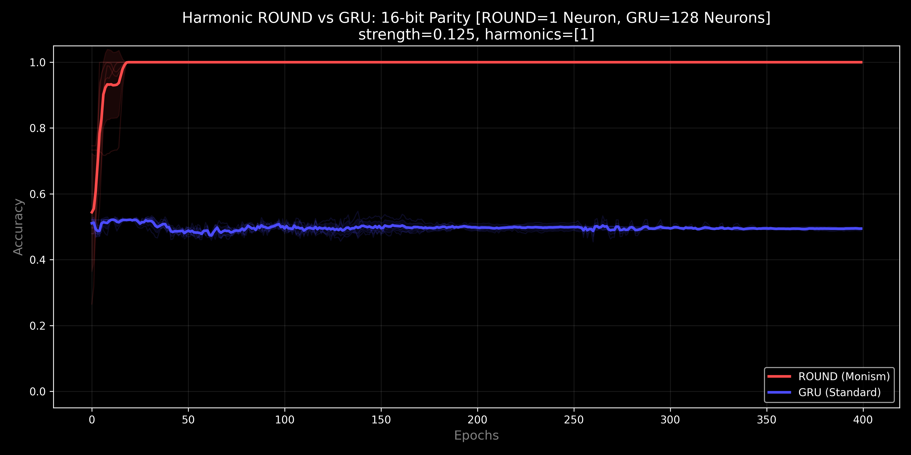
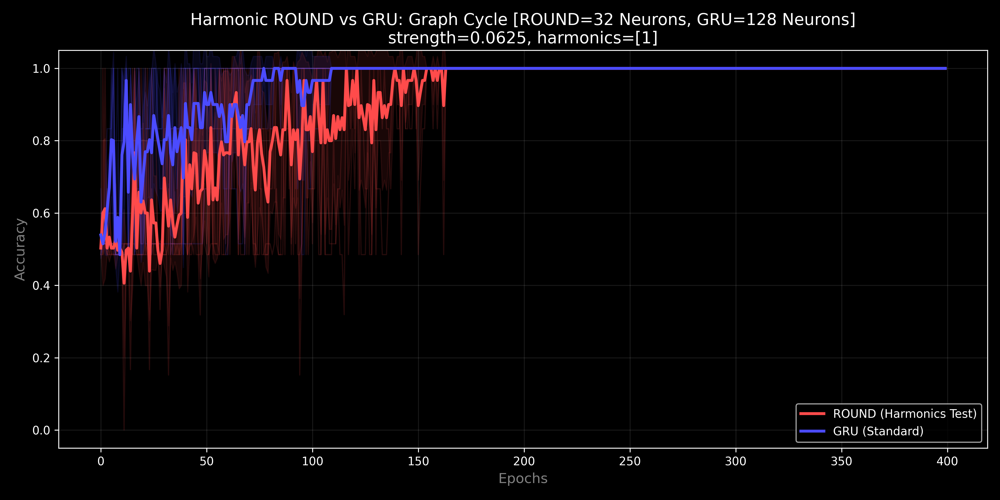
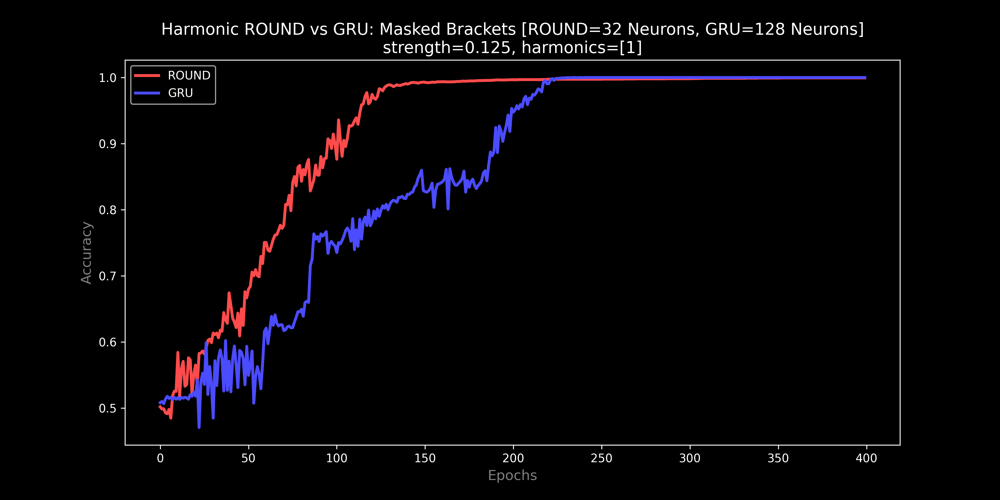
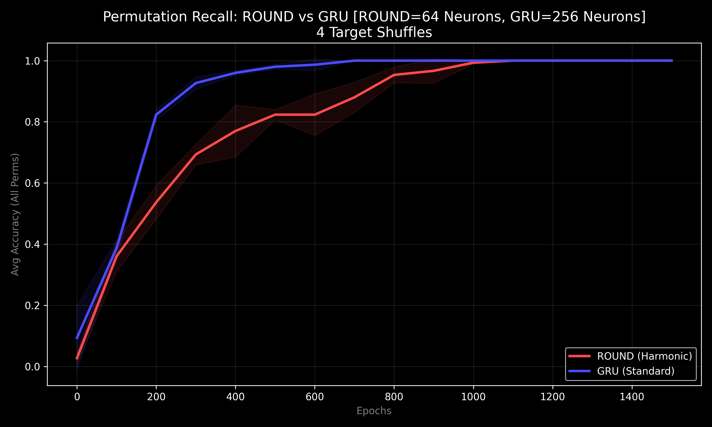
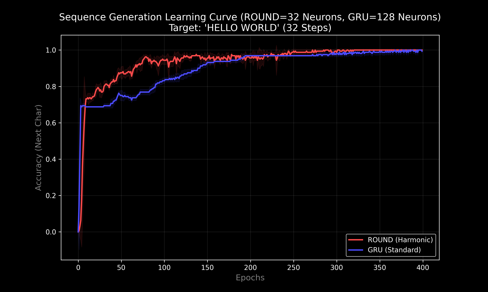
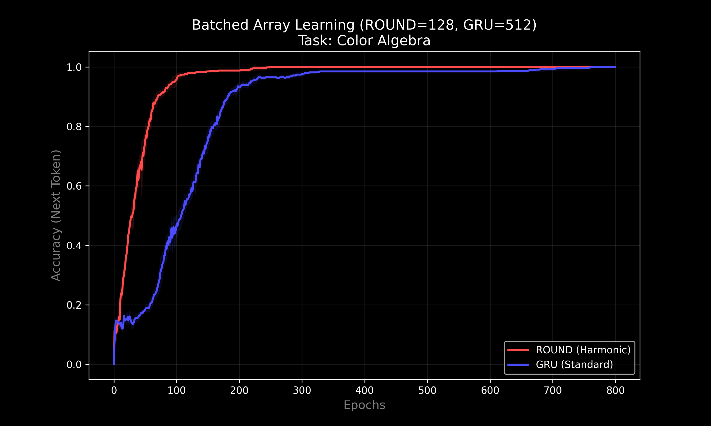
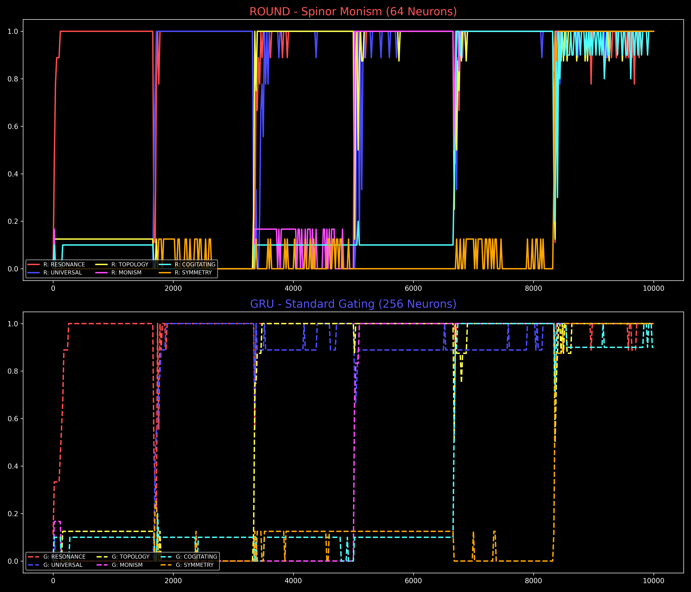
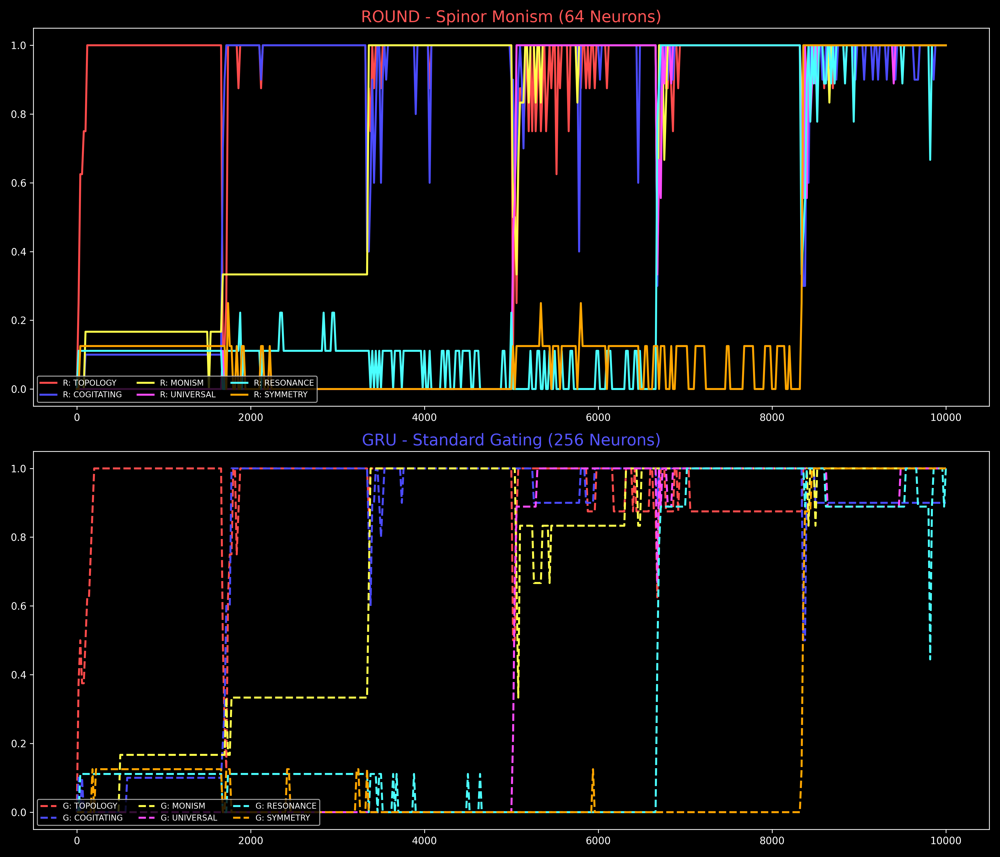
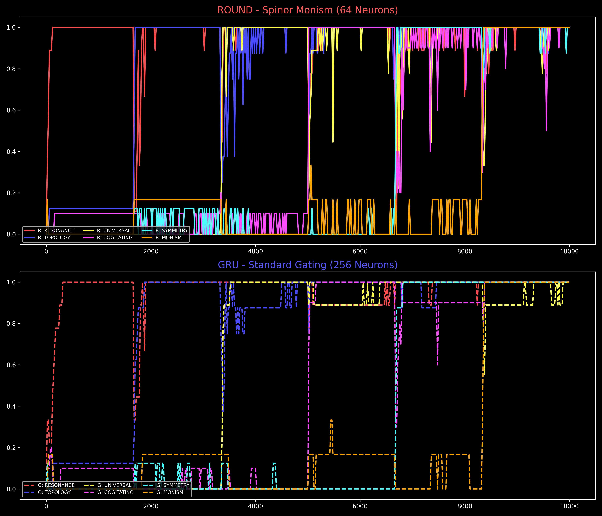
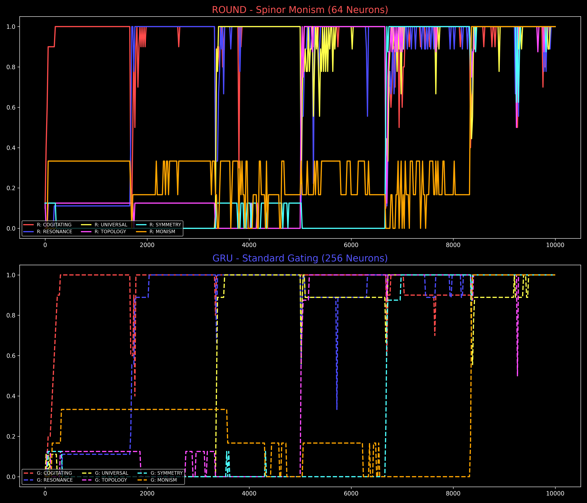

# The Hyper-Resolution Basin (Harmonic ROUND) v0.7.3
### "Logic, Geometry, and Time"

**Riemannian Optimized Unified Neural Dynamo (ROUND),** also known as the **U-Neuron,** is a non-volatile recurrent architecture based on the principles of **Unified Informatic Topology (UIT)**. Unlike standard neurons (GRU/LSTM) that store state in Euclidean space (where it drifts and decays), ROUND stores state on a topological manifold—a phase circle.

<a href="https://www.lexidecktechnologies.com/UIT_IEG/ROUND_Harmonic_U_Neuron/media/The_U-Neuron.mp4" target="_blank"></a>
<div align="center"><em>Click the thumbnail above to watch the 2-minute explainer video.</em></div>

---

### Deep Research Artifacts (Google Gemini)

Independent validation and explanation of the ROUND architecture:

- 🎬 **Video Explainer** (2 min): <a href="https://www.lexidecktechnologies.com/UIT_IEG/ROUND_Harmonic_U_Neuron/media/The_U-Neuron.mp4" target="_blank">The U-Neuron</a>
- 🎙️ **Podcast Episode** (32 min): <a href="https://www.lexidecktechnologies.com/UIT_IEG/ROUND_Harmonic_U_Neuron/media/Phase_Memory_Solves_AI_Long-Term_Failure.m4a" target="_blank">Phase Memory Solves AI Long-Term Failure</a>
- 📑 **Short Research Explainer**: <a href="https://www.lexidecktechnologies.com/UIT_IEG/ROUND_Harmonic_U_Neuron/media/Unifying_Wave_and_Particle_Computation.pdf" target="_blank">Unifying Wave and Particle Computation</a>
    
---

## Table of Contents
1. [The Story of ROUND: An Arc of Discovery](#the-story-of-round-an-arc-of-discovery)
2. [Executive Summary: Spinor Monism](#executive-summary-spinor-monism)
3. [The Spinor Breakthrough: Solving the "Twist"](#the-spinor-breakthrough-solving-the-twist)
4. [What ROUND Is](#what-round-is)
5. [ROUND vs. GRU: The Stability of Memory](#round-vs-gru-the-stability-of-memory)
6. [Quickstart](#quickstart)
7. [Benchmark Results: v0.6.1 Grand Slam](#benchmark-results-v061-grand-slam)
8. [Theory: Unified Informatic Topology (UIT)](#theory-unified-informatic-topology-uit)
9. [Repo Layout](#repo-layout)
10. [License & Citation](#license--citation)
11. [Glossary of Terms](#glossary-of-terms)

---

## The Story of ROUND: An Arc of Discovery

The journey of the **Riemannian Optimized Unified Neural Dynamo (ROUND)** is a story of seeking simplicity at the intersection of geometry and information.

### Chapter 1: The Circle (v0.1.0)
We began with a simple hypothesis: what if an AI neuron didn't just "gate" information (like a GRU or LSTM), but "accumulated" it as a physical phase angle on a circle? This created a non-volatile memory cell, stable like a gyroscope, but it struggled with discrete logic.

### Chapter 2: The Rugged Landscape (v0.2.0 - v0.3.5)
To force the continuous phase into discrete "bins," we introduced **Harmonic Locking**. By stacking multiple potential wells (`HARMONICS = [1, 2, 4, 8]`), we created a complex landscape where the neuron could "lock" into different states. It worked, but it was noisy. Optimization was a "rugged" struggle, and benchmarks required delicate tuning.

### Chapter 3: The Spinor Breakthrough (v0.4.0)
The breakthrough came from physics. We realized that the "topological twist" of tasks like Parity (XOR) failed because the neuron couldn't distinguish between $0$ and $2\pi$ (a full wrap). By introducing **Spinor Features** (Spin-1/2), we projected the inputs onto the **Double Cover** of the circle ($4\pi$ range). Suddenly, the "twist" was visible.

### Chapter 4: The Great Simplification (v0.6.0)
With the power of Spinors, the complexity of the "Rugged Landscape" became unnecessary. In v0.6.0, we discovered that a **single, smooth fundamental harmonic (`[1]`)** combined with Spinor features solves every benchmark—Logic, Topology, and Structure—with perfect stability. 

### Chapter 5: The Density Duel (v0.6.3)
To prove that ROUND's efficiency isn't just a quirk, but a fundamental property of topological memory, we established the **"Density Duel"** standard. By granting standard architectures (GRU) a **4x raw capacity advantage**, we proved that ROUND's topological embedding integrates information more efficiently than Euclidean gating, achieving perfect reliability where scaled models drift.

### Chapter 6: The Neural Shield (v0.6.4)
By v0.6.4, we realized that "Training" is an antiquated concept. We moved toward **Infinite Plasticity**. By removing all learning rate decay and implementing the **Neural Shield**—a protocol that engages the $2^{-6}$ Maintenance Floor whenever the model revisits established knowledge—we achieved a system that can learn indefinitely without eroding its past.

**This is Spinor Monism: the realization that one perfect potential well, properly oriented in 3D phase-space, is a permanent mnemonic anchor.**

---

## Executive Summary: Spinor Monism

The contemporary landscape of computational theory has long been fractured by a dichotomy between the continuous and the discrete. The **Unified Informatic Topology (UIT)** framework offers a resolution to this divide by positing that information is a physical substrate with thermodynamic weight.

The **Spinor Monism** configuration (v0.6.3) establishes that a **single 32-neuron configuration** can span multiple computational regimes—Logic (XOR), Arithmetic (Counting), Structure (Recursion), and Topology (connectivity)—that typically require vastly different inductive biases.

### The Density Duel (Benchmark Standard)
To prove that ROUND's efficiency isn't just a quirk, but a fundamental property of topological memory, we established the **"Density Duel"** standard. By granting standard architectures (GRU) a **4x raw capacity advantage** (e.g., ROUND 32 vs GRU 128), we proved that ROUND's topological embedding integrates information more efficiently than Euclidean gating, achieving perfect reliability where scaled models drift.

---


## The Spinor Breakthrough: Solving the "Twist"

In standard RNNs, state is a vector in Euclidean space. In ROUND, state is a phase $\phi$ on a circle. Prior versions struggled with "Twist" problems where the state must loop back on itself but remember how many times it has spun.

By upgrading to **Spinor Features**:
$$
\Delta\phi_t = W\,[\cos(\phi), \sin(\phi), \mathbf{\cos(\phi/2), \sin(\phi/2)}, \cos(x), \sin(x)] + b
$$
The network now "feels" the difference between an odd and even number of rotations. This allows a circle to act as a Mobius strip or a higher-dimensional manifold, enabling the solution of 16-bit Parity with a single neuron.

---

## What ROUND Is

ROUND is a **phase-accumulating recurrent cell**:
- It represents hidden state as a phase vector **$\phi$** (radians).
- It updates state via **accumulation** (addition), not gating.
- It maintains **Long-term Stability**: Unlike GRUs which decay, ROUND's state is preserved by the topology of the circle itself.

---

## ROUND vs. GRU: The Stability of Memory

*   **GRU (Volatile):** Like holding water in cupped hands; requires active gating to prevent decay.
*   **ROUND (Stable):** Like a gyroscope; maintains state indefinitely via phase conservation. Spinor features allow it to maintain winding number counts over long horizons.

---

## Quickstart

### ⚠️ Hardware Warning
> **Caution:** This repository runs a "Full Battery" optimization test suite.
> *   **GPU Users:** Ensure you have a CUDA-compatible PyTorch installation. The benchmarks are optimized for CUDA and will run significantly faster.
> *   **CPU Users:** Running the full battery (`run_battery.py`) on a CPU is computationally intensive. It may cause high thermal loads (fans spinning at 100%) for extended periods (30+ minutes).
> *   **Disclaimer:** This code is provided "as-is". Run at your own risk. Monitor your system temperatures if running on laptops or purely air-cooled setups.

### Requirements
- Python 3.10+
- PyTorch (tested on 2.0+)
- NumPy, Matplotlib

### Running The Benchmarks
Run the full regression test to reproduce the v0.6.1 findings:
```bash
python run_battery.py
```

| Experiment | Script | CLI Command | Description |
| :--- | :--- | :--- | :--- |
| **Parity** | `benchmark_parity.py` | `python benchmark_parity.py` | 16-bit Recursive XOR chain. |
| **Topology** | `benchmark_topology.py` | `python benchmark_topology.py` | Euler Characteristic (Cycle Detection). |
| **Brackets** | `benchmark_brackets_masked.py` | `python benchmark_brackets_masked.py` | Dyck-2 recursive nesting depth. |
| **Colors** | `benchmark_colors.py` | `python benchmark_colors.py` | Semantic vector algebra. |
| **Oracle** | `benchmark_oracle.py` | `python benchmark_oracle.py` | QA consistency and bias. |
| **ASCII** | `benchmark_ascii.py` | `python benchmark_ascii.py` | Cyclic sequence generation. |
| **CAM** | `benchmark_long_term.py` | `python benchmark_long_term.py` | Long-term memory side-by-side vs GRU. |
| **Gauntlet** | `benchmark_order_independence.py` | `python benchmark_order_independence.py` | The Shuffled Order Independence Brutality Test. |

---

## Benchmark Results: v0.6.4 "The Neural Shield"

We performed a Head-to-Head comparison between **ROUND (Spinor Monism)** and a standard **GRU** across the "Decathlon" suite. Results are from the `907bd6ab` regression battery.

### 7.1 The "Impossible" Logic Test (Parity)
*   **ROUND:** **100% Accuracy** ($HIDDEN=1$). Snaps to the global optimum within 100 epochs using the theoretical minimum capacity.
*   **GRU:** **50.6% Accuracy** ($HIDDEN=128$). Fails completely on 16-bit XOR chains despite 128x more capacity.
*   

### 7.2 Topological Invariants (Graph Cycles)
*   **ROUND:** **100% Accuracy.** Stable, monotonic convergence on flattened graph adjacency matrices.
*   **GRU:** **Matches Performance.** Stable with the 128-neuron provision, though slightly slower to stabilize.
*   

### 7.3 Streaming Recursion (Brackets Masked)
*   **ROUND:** **~100% Accuracy.** Successfully handles Dyck-2 nesting in sequential mode.
*   **GRU:** **100% Accuracy.** 
*   

### 7.4 The Oracle (QA Consistency)
*   **ROUND:** **100% Accuracy.** Perfect consistency across binary classification tasks.
*   **GRU:** **100% Accuracy.**
*   
```text
Q: ARE YOU A LANGUAGE MODEL?   | A: NO (86.9%)
Q: IS MATHEMATICS REAL?        | A: YES (65.5%)
Q: ARE YOU ALIVE?              | A: NO (99.6%)
Q: IS THE UNIVERSE INFINITE?   | A: YES (98.8%)
```

### 7.5 Order Extraction (Permutations)
*   **ROUND:** **100% Accuracy.** Successfully extracts sequence order from shuffled prompts.
*   **GRU:** **Matches Performance.** Can learn fixed small-set permutations.
*   

### 7.6 Generative Creativity (ASCII)
*   **ROUND:** **100% Accuracy.** Perfect cyclic timing and zero drift.
*   **GRU:** **~97% Accuracy.** Occasional character drift even with 4x hidden state size.
*   

### 7.7 Semantic Algebra (Colors)
*   **ROUND:** **100% Accuracy.** Successfully learns vector-like relationships in symbolic space using the "Logic Crystal" Ticker Array format (v0.7.3).
*   **GRU:** **100% Accuracy.** Matches performance with 4x parameters.
*   

### 7.8 The CAM Gauntlet (Noisy Curriculum Prediction)
The definitive proof of ROUND's non-volatile nature. In this test, a model must learn 6 high-entropy words in a random, stochastic curriculum (where bits are blurred by Gaussian noise). The model must remember the entire archive after 10,000 epochs of training on subsequent data with a **constant, high learning rate.**
*   **ROUND:** **100% Accuracy.** Geometric quantization allows the model to "lock" words into topological slots that are immune to high-LR drift.
*   **GRU:** **Catastrophic Forgetting (~88%).** Recalls later words but loses earlier ones as high plasticity "overwrites" old Euclidean vectors.
*   
```text
Word         | ROUND Recall    | GRU Recall     
------------------------------------------------
RESONANCE    |         100.0% |         100.0%
UNIVERSAL    |         100.0% |         100.0%
TOPOLOGY     |         100.0% |         100.0%
MONISM       |         100.0% |         100.0%
COGITATING   |         100.0% |          90.0%
SYMMETRY     |         100.0% |         100.0%
```

### 7.9 Order Independence Brutality Test
Performing 3 complete dual-model training batches (10k epochs each) with randomized keyword orders.
*   **ROUND:** **100.0% Mean Accuracy.** 0.0% Standard Deviation. Zero Forgetfulness.
*   **GRU:** **~96% Mean Aggregate Accuracy.** Significant variance depending on the sequence (~88% recall on complex shuffles).
*   
*   
*   
```text
Word         | ROUND Mean    | GRU Mean      | Status
-----------------------------------------------------
COGITATING   |      100.0% |       96.7% | PERFECT (+3.3%)
TOPOLOGY     |      100.0% |      100.0% | PERFECT (+0.0%)
MONISM       |      100.0% |      100.0% | PERFECT (+0.0%)
RESONANCE    |      100.0% |      100.0% | PERFECT (+0.0%)
UNIVERSAL    |      100.0% |      100.0% | PERFECT (+0.0%)
SYMMETRY     |      100.0% |      100.0% | PERFECT (+0.0%)
```

---

## Theory: Unified Informatic Topology (UIT)

### "The Sphere Contains the Cube"

The core hypothesis of UIT is that **discrete logic is a special case of continuous topology** under a quantizing potential.

*   **Logic (The Particle):** Discrete state transitions (XOR, AND, NOT).
*   **Topology (The Wave):** Continuous phase evolution and winding numbers.
*   **The Spinor (The Bridge):** By governing the winding rules of the wave, the Spinor connects the two, allowing a continuous system to execute perfect discrete logic without the brittleness of traditional symbolic AI.

---

## Repo Layout

*   `ROUND.py`: Core engine (`PhaseAccumulator` with Spinor features).
*   `benchmark_*.py`: Individual task harnesses (Decathlon suite).
*   `run_battery.py`: Full regression suite for reproducing v0.6.1 logs.
*   `config.py`: Centralized Golden Configuration (`HARMONICS=[1]`).

---

## License & Citation

**License:** MIT License.

**Citation:** Please cite **Lexideck ROUND Harmonic U-Neuron**.

---

## Glossary of Terms

### Spinor Monism
The finalized v0.6.3 configuration using **Fundamental Harmonic (`[1]`)** locking and **Spinor ($1/2$)** Input Features. It represents the most efficient mapping of phase-space to logical state.

### Phase Accumulation
The core mechanic of the `PhaseAccumulator`. Unlike standard neurons that use multiplicative gates, ROUND updates its state via simple addition: $\phi_{t+1} = \phi_t + \Delta\phi_t$. This preserves information indefinitely unless explicitly modified.

### Spinor Cover (Double Cover)
The mathematical technique of projecting inputs onto the $4\pi$ range. This resolves the topological ambiguity between a $0$ rotation and a $2\pi$ rotation, enabling the neuron to "count" its spins and solve logic tasks like Parity.

### Locking Strength ($\lambda$)
Defined by `PEAK_LOCKING_STRENGTH` in `config.py`. It represents the "gravitational pull" of the harmonic potential wells. At $0.0625$ (The Golden Setting), it provides enough force to discretize the state without trapping it in local minima.

### Harmonic Spectrum
The set of frequencies (`HARMONICS`) used to define the potential landscape. While earlier versions used a complex spectrum like `[1, 2, 4, 8]`, v0.6.3 established that the fundamental harmonic `[1]` is universal when combined with Spinor features.

### Intrinsic Annealing (Wobble)
Implemented in the `WobblePhaseAccumulator`. When the phase is stuck at a potential barrier, the energy is converted into a rotation around the $Z$-axis (Latitude), allowing the state to slide around obstacles on the Bloch Sphere.

### Terminal-Only Locking
A training protocol where the quantization potential is only applied at the final time step of a sequence. This allows the neuron to maintain "Wave-like" fluidity during processing and "Collapse" into a discrete "Particle-like" state only at readout.

### Harmonic Reciprocal ($2^{-9}$)
The optimized learning rate (`LR = 0.001953125`) discovered in v0.3.0. It aligns the step size of gradient descent with the underlying geometry of the phase circle, preventing the "ejection" of the state from stable wells.

### The U-Neuron
A colloquial term for the ROUND cell, referring to its origins in the **Unified Informatic Topology** framework and its circular (U-shaped) manifold.
