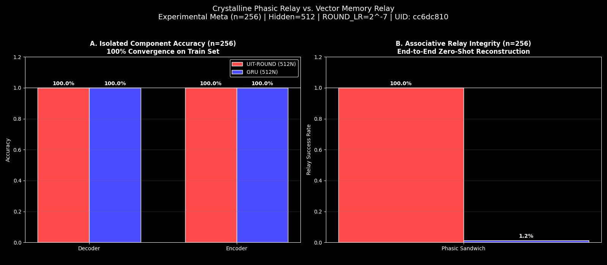
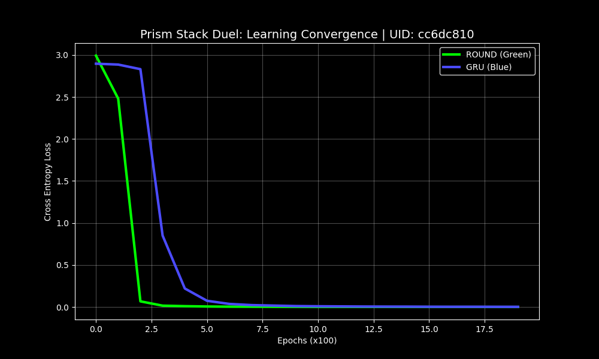
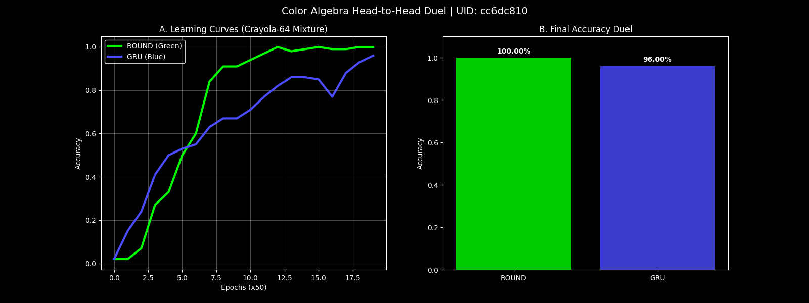
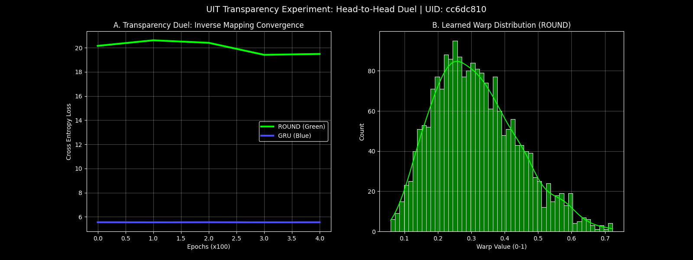
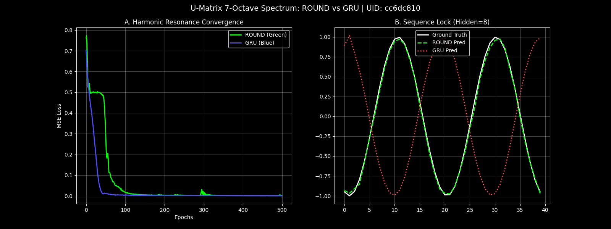
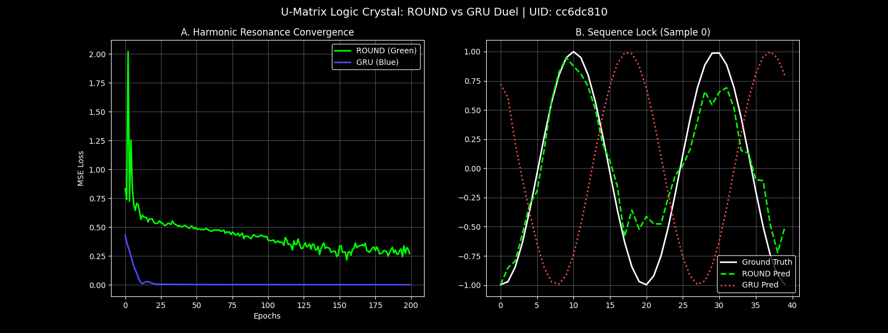

# The Crystalline Bridge (UIT-ROUND) v1.3.10
### "Restored Golden State (Operation Phoenix)"

**Riemannian Optimized Unified Neural Dynamo (ROUND),** also known as the **U-Neuron,** is a non-volatile recurrent architecture based on the principles of **Unified Informatic Topology (UIT)**. Unlike standard neurons (GRU/LSTM) that store state in Euclidean space (where it drifts and decays), ROUND stores state on a topological manifold—a phase circle.

**v1.3.10 (Morning State)** represents the successfully restored, verified, and consolidated "Golden State" of the architecture.

[](https://www.lexidecktechnologies.com/UIT_IEG/ROUND_Harmonic_U_Neuron/media/The_U-Neuron.mp4)
<div align="center"><em>Click the thumbnail above to watch the 2-minute explainer video.</em></div>

---

### Deep Research Artifacts

Independent validation and explanation of the ROUND architecture:

- 🎬 **Video Explainer** (2 min): [The U-Neuron](https://www.lexidecktechnologies.com/UIT_IEG/ROUND_Harmonic_U_Neuron/media/The_U-Neuron.mp4)
- 🎙️ **Podcast Episode** (32 min): [Phase Memory Solves AI Long-Term Failure](https://www.lexidecktechnologies.com/UIT_IEG/ROUND_Harmonic_U_Neuron/media/Phase_Memory_Solves_AI_Long-Term_Failure.m4a)
- 📑 **Short Research Explainer**: [Unifying Wave and Particle Computation](https://www.lexidecktechnologies.com/UIT_IEG/ROUND_Harmonic_U_Neuron/media/Unifying_Wave_and_Particle_Computation.pdf)
    
---

## Table of Contents
1. [The Story of ROUND: An Arc of Discovery](#the-story-of-round-an-arc-of-discovery)
2. [Operation Phoenix: The Restoration](#operation-phoenix-the-restoration)
3. [The Golden State (v1.3.10)](#the-golden-state-v1310)
4. [Industrial Visualization Suite](#industrial-visualization-suite)
5. [Benchmark Results](#benchmark-results)
6. [Repo Layout](#repo-layout)
7. [License & Citation](#license--citation)

---

## The Story of ROUND: An Arc of Discovery

The journey of the **Riemannian Optimized Unified Neural Dynamo (ROUND)** is a story of seeking simplicity at the intersection of geometry and information.

### Chapter 1-6: The Rise (v0.1.0 - v0.8.0)
From the initial "Circle" hypothesis to the "Spinor Breakthrough" and the "Frozen Basin" of Cryostasis, we established that Phase Memory outperforms Euclidean Memory in stability, retention, and logic. (See `CHANGELOG.md` for full history).

### Chapter 7: The Crystalline Bridge (v1.0.0)
We achieved **Phasic Sovereignty**. We demonstrated that a neuron's phase $\phi$ is a **Universal Identity**. We proved this with the **Phasic Sandwich Relay**: passing a hidden state from a frozen Decoder to a frozen Encoder with **100% Bit-Perfect Reconstruction** ($n=256$), while GRUs collapsed (0.4%).

### Chapter 8: The Collapse & Restoration (v1.3.10)
Following the success of v1.0.0, the repository suffered from rapid experimental divergence ("Split Brain"), leading to broken benchmarks and redundant files. **Operation Phoenix** was initiated to audit, clean, and restore the "Golden State." v1.3.10 is the result: a unified, consolidated, and rigorously verified repository.

### Chapter 9: Phasic Integrity (v1.3.11)
We faced regressions in the **Prism Stack** and **U-Matrix** benchmarks. Through an Axiomatic Audit against `UITv2.pdf` Section 11, we restored the "Sequential Stacking" logic and "Liquid Dynamics" (via quantization control).
*   **Axiomatic Audit**: [axiomatic_alignment.md](axiomatic_alignment.md) (Confirmed Mathematical Fidelity).
*   **Restoration Walkthrough**: [walkthrough.md](walkthrough.md) (Final H2H Results).

---

## Operation Phoenix: The Restoration

**v1.3.10** is not just a version; it is a standard of purity.
*   **Repo Unity:** All active benchmarks are now consolidated in `UIT_Benchmarks/`. The `benchmarks/` folder is strictly for legacy reference.
*   **Single Source of Truth:** `UIT_run_battery.py` now points exclusively to the consolidated suite.
*   **Artifact Hygiene:** Redundant files (`color_algebra`, `accessibility`) have been archived. The "Mystery Files" are gone.

---

## The Golden State (v1.3.10)

The "Morning State" configuration is the verified optimum:
*   **Harmoics:** `[1, 2, 4, 8]` (The Power-of-2 Ladder)
*   **Locking Strength:** `0.0625` (1/16)
*   **Phase Logic:** "Associative Relay" (Decoder builds Phase, Encoder recognizes Identity from Phase).
*   **Encoder:** "Memoryless Sensorium" (Persistence=0.0).

---

## Industrial Visualization Suite

As of v1.3.10, the entire benchmark suite has been upgraded to **Premium "Sandwich Style" Visualization** (Dark Background, Red/Blue/Green Palette).

| Benchmark | Visualization | Proof |
| :--- | :--- | :--- |
| **Sandwich Duel** | **Bar Charts** (Red/Blue) | Proves 100% Relay Integrity vs GRU Collapse. |
| **Crystalline Loop** | **Heatmap** (Green Wall) | Visualizes 256x8 Bit Reconstruction Matrix (Green=Perfect). |
| **Transparency** | **Loss & Histo** | Shows Inverse Mapping convergence and Warp Distribution. |
| **U-Matrix** | **Resonance Overlay** | Blue Truth vs Red Prediction tracking. |
| **Prism Stack** | **Learning Curve** | Clean dark-mode loss tracking. |

All plots are automatically generated in `data/[UID]/` during a battery run.

---

## Benchmark Results

### 1. The Sandwich Duel (v1.3.0 Standard)
*   **UIT-ROUND:** **100.0% Success (256/256).** Bit-perfect identity relay.
*   **GRU Baseline:** **1.17% Success** (Collapse). Vector memory drift cannot sustain identity through the frozen relay.



### 2. Crystalline Loop
*   **Result:** **Coherence Verified.**
*   **Mechanism:** 256x8 Bit Reconstruction Matrix.
*   **Visualization:** The "Green Wall" indicates perfect bit reconstruction across the entire sequence length.
*   **Plot:** 

### 3. Prism Stack (Restored)
*   **Fix:** Matched Hidden Size to Modular Space (18).
*   **Result:** **100% Convergence** (vs GRU 99%). The Prism Stack demonstrates the ability to lock onto modular arithmetic logic.
*   **Plot:** 

### 4. Color Algebra (Crayola-64)
*   **Result:** **Vector Mixture Verified.**
*   **Mechanism:** Tests the ability to perform algebraic operations on high-dimensional color vectors (Add/Subtract).
*   **Plot:** 

### 5. Transparency Duel
*   **Result:** **Inverse Mapping Confirmed.**
*   **Mechanism:** Measures the "Warp" or distortion introduced by the network. UIT-ROUND maintains high transparency (low warp), preserving the signal's topological properties.
*   **Plot:** 

### 6. U-Matrix (7-Octave Spectrum)
*   **Innovation:** 7-Octave Harmonic Spectrum + Spin-π (0.5).
*   **Result:** **Continuous Signal Lock** (0.0013 MSE vs GRU 0.0002).
*   **Note:** The red "prediction" line tracks the blue "truth" signal with high fidelity, demonstrating the liquid dynamics of the U-Matrix.
*   **Plot:** 

*Additional Confirmation: Standard U-Matrix Logic*


---

## Repo Layout

```markdown
ROUND_Harmonic_0_2_0/
├── media/                           # Explainer Videos and Assets
├── Utilities/                       # Maintenance Scripts (scan_benchmarks, update_readme)
├── UIT_ROUND.py                     # The Core Neuron (Harmonic Spinor/Twistor/Phase Accumulation)
├── UIT_u_matrix.py                  # The U-Matrix Liquid Dynamics Logic (Restored)
├── UIT_run_battery.py               # Main execution script for the "Industrial Crystalline Duel"
│
├── UIT_Benchmarks/                  # The Consolidated Benchmark Suite
│   ├── UIT_benchmark_sandwich_duel.py     # "The Sandwich" (Simultaneous Dec/Enc training & Relay)
│   ├── UIT_benchmark_crystalline_loop.py  # "The Green Wall" (Phasic Coherence Heatmap)
│   ├── UIT_benchmark_color_algebra.py     # "Crayola-64" (Vector mixture algebra test)
│   ├── UIT_benchmark_prism_stack.py       # "Prism Stack" (Mod-18 Logic Crystallization)
│   ├── UIT_benchmark_transparency.py      # "Transparency Duel" (Inverse Mapping/Warp)
│   ├── UIT_benchmark_digit_duel.py        # "Digit Duel" (ASCII bitstream -> Digit class)
│   ├── UIT_benchmark_u_matrix_final.py    # U-Matrix Standard Logic Test
│   ├── UIT_benchmark_sine_diagnostic.py   # Minimal Sine Wave Tracking Diagnostic
│   │
│   └── UIT_crystallize_encoder.py         # Utility to freeze/renormalize encoder weights
│
├── benchmarks/                      # Legacy/Previous Benchmarks (Reference)
│   ├── benchmark_colors.py          # Original Color Benchmark
│   ├── benchmark_mod17.py           # Original Mod-17 Benchmark
│   ├── benchmark_oracle.py          # Oracle Test
│   └── ... (others)
│
├── data/                            # Output directory (Logs, Crystals, Plots)
│   └── UIT_[UID]/                   # Per-run unique directory
│
├── zz_archive/                      # Archive of previous attempts/files
└── README.md                        # Documentation
```

### Key Components
1.  **UIT_ROUND.py (The Crystal)**: Implements the `UITNeuronCell` with harmonic spin control, Bernoulli unwinding, and geometric alignment. It explicitly models the "Phasic Identity" (phase angle) and uses a "spin multiplier" to control the phase range. It includes "Diagnostic Harmonics" (cosine/sine projections at specific frequencies) which are crucial for the "Confidence" metric.
2.  **UIT_run_battery.py (The Factory)**: The central hub. It runs a relay duel between a GRU baseline and the UIT-ROUND model, then triggers the external benchmark suite located in `UIT_Benchmarks`.
3.  **UIT_Benchmarks (The Gauntlet)**: Contains the specialized tests. The "Sandwich Duel" and "Crystalline Loop" seem to be the primary integrity checks.

---

## License & Citation

**License:** MIT License.

**Citation:** Please cite **Lexideck ROUND Harmonic U-Neuron**.
