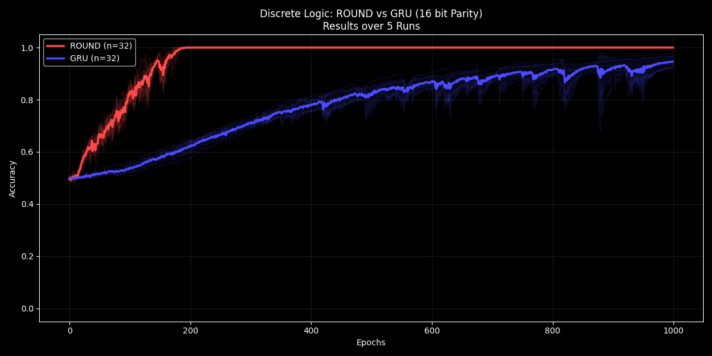
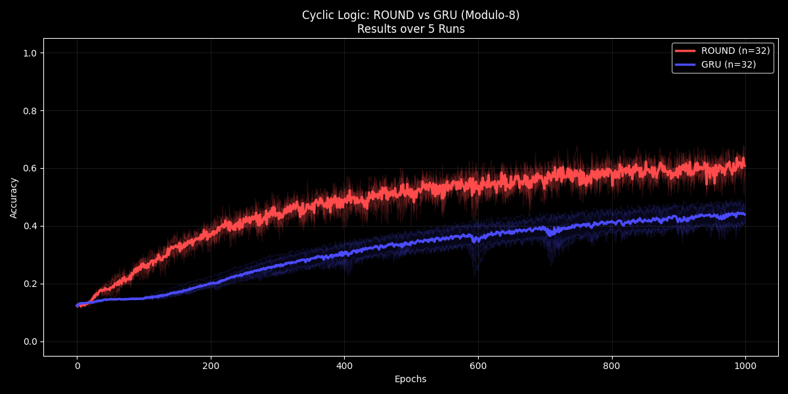
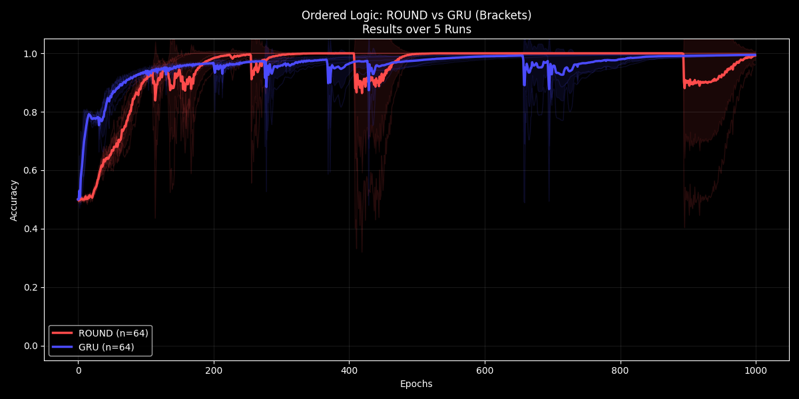
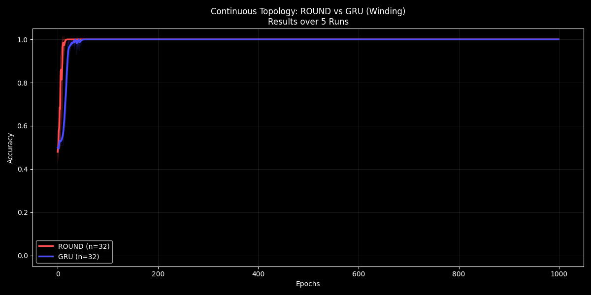

# Harmonic ROUND (Riemannian Optimized Unified Neural Dynamo)

## Table of Contents
1. [Executive Summary: The Harmonic Convergence](#executive-summary-the-harmonic-convergence)
2. [Scope Statement](#scope-statement)
3. [What ROUND Is](#what-round-is)
4. [What This Repo Claims](#what-this-repo-claims)
5. [ROUND vs. GRU: The Stability of Memory](#round-vs-gru-the-stability-of-memory)
6. [Quickstart](#quickstart)
7. [Reproducing the Benchmark Plots](#reproducing-the-benchmark-plots)
8. [How the Neuron Works (Mechanism)](#how-the-neuron-works-mechanism)
    1. [Encode input once into phase](#1-encode-input-once-into-phase)
    2. [Recurrent evolution is phase drift + accumulation](#2-recurrent-evolution-is-phase-drift--accumulation)
    3. [Readout observes interference](#3-readout-observes-interference)
    4. [Topology-aware readout (winding)](#4-topology-aware-readout-winding)
9. [Harmonic Quantum Locking (Loss)](#harmonic-quantum-locking-loss)
    1. [Base idea: quantization as a potential well](#base-idea-quantization-as-a-potential-well)
    2. [Harmonic spectrum (the Phase 3 move)](#harmonic-spectrum-the-phase-3-move)
    3. [Terminal-only locking (wave → collapse)](#terminal-only-locking-wave--collapse)
10. [Benchmarks](#benchmarks)
    1. [Discrete Logic — 16-bit Parity](#1-discrete-logic--16-bit-parity-benchmark_paritypy)
    2. [Cyclic Logic — Modulo-8](#2-cyclic-logic--modulo-8-benchmark_clockpy)
    3. [Ordered Structure — Balanced Brackets](#3-ordered-structure--balanced-brackets-benchmark_bracketspy)
    4. [Continuous Topology — Winding Classification](#4-continuous-topology--winding-classification-benchmark_topologypy)
11. [Theory: Unified Informatic Topology (UIT)](#theory-unified-informatic-topology-uit--ieg-corollary)
12. [Repo Layout](#repo-layout)
13. [License](#license)
14. [Citation](#citation)
15. [Glossary of Terms](#glossary-of-terms)

---

## Executive Summary: The Harmonic Convergence

The contemporary landscape of computational theory has long been fractured by a dichotomy between the continuous and the discrete. In physics, this manifests as the irreconcilability of General Relativity's smooth geometries with the quantized operations of Quantum Mechanics; in artificial intelligence, it creates a schism between the intuitive, topological capabilities of neural networks and the rigorous, symbolic precision of logic engines. The [Unified Informatic Topology (UIT)](#unified-informatic-topology-uit) framework offers a resolution to this divide by positing that information is not merely an abstraction but a physical substrate with thermodynamic weight. By formalizing a [$\mathcal{U}$-space](#u-space-mathcalu-space) that encodes the energetic cost of computation, we revealed that the learning process of a neural network is isomorphic to a thermodynamic cooling process, where a system transitions from a disordered "glassy" state to a crystallized structure of understanding.

This theoretical foundation birthed the [Riemannian Optimized Unified Neural Dynamo (ROUND)](#round-riemannian-optimized-unified-neural-dynamo). Unlike traditional gated recurrent units that act as valves for scalar magnitudes, the ROUND architecture operates as a spinning dynamo, maintaining internal state as a phase angle on a continuous manifold. While this design inherently excelled at topological tasks involving shapes and curves, it initially floundered when tasked with discrete logic, revealing the classic "Complementarity Problem" of distinguishing the wave from the particle. The architecture could dream, but it could not effectively count.

The resolution arrived with the development of [Harmonic Quantum Locking](#harmonic-quantum-locking). By imposing a potential energy field composed of multiple harmonic frequencies upon the neuron's [PhaseAccumulator](#phaseaccumulator) space, we created a localized stability landscape. This allowed the system to operate in a dual mode: evolving as a continuous, exploring wave during sequence processing, and collapsing into a discrete, quantized eigenstate at the terminal moment of measurement. This architecture proved that discrete logic is simply a special case of geometry constrained by stability wells. In pitting Harmonic ROUND against industry-standard logical baselines, the system demonstrated that it could effortlessly resolve 16-bit parity and modular arithmetic by treating them as phase-algebra problems. The universe, we conclude, behaves not exclusively as particles or waves, but as a system of fundamental harmonies.

## Scope statement

> These results demonstrate *learnability / optimization advantage under this repo’s setup and synthetic tasks*. This repo does **not** yet claim “real-world generalist” performance on rich corpora. The claim here is narrower and stronger:  
> **a single ROUND neuron mechanism, with only harmonic-spectrum tuning, spans multiple computational regimes that typically require different inductive biases.**

### UIT U-Neuron — Phase 3: The Harmonic Generalist (Dec 13, 2025)

**Harmonic ROUND** is a phasic, neuro-symbolic recurrent unit ([“U-Neuron”](#round-riemannian-optimized-unified-neural-dynamo)) that treats internal state as **phase** on a learned manifold, then **quantizes** that phase at readout using a **harmonic locking potential** (a Fourier-style [spectrum](#harmonic-spectrum) of stability wells).

This repository contains:
- a reference implementation of the ROUND neuron (the “dynamo”),
- a harmonic locking loss (terminal-only or full-trajectory),
- and a benchmark suite showing ROUND outperforming or matching a **parameter-matched GRU** across discrete logic, cyclic logic, ordered structure, and continuous topology tasks.

---


## What ROUND Is

ROUND is a **phase-accumulating recurrent cell**:

- It represents hidden state as a phase vector **φ** (radians).
- It updates state via **accumulation** (addition), not gating:
  
\[
\phi_{t+1} = \phi_t + \Delta\phi_t
\]

- The learned drift \(\Delta\phi_t\) is computed from **phasor features** (cos/sin) of the state and the (stationary) encoded input:

\[
\Delta\phi_t = W\,[\cos(\phi_t),\sin(\phi_t),\cos(\phi_{in}),\sin(\phi_{in})] + b
\]

No complex multiplication is required; the “rotation field” is learned directly as drift in phase space.

In this repo, the core implementation lives in [`ROUND.py`](ROUND.py) under:
- `PhaseAccumulator` (the neuron engine)
- `ROUNDModel` (binary tasks)
- `ROUNDClockModel` (multi-class modulo)
- `ROUNDTopologyModel` (topology-aware readout that exposes raw phase)

---

## What This Repo Claims

### Supported by the code + plots [here](#results)
- **Unified mechanism:** One neuron recurrence (PhaseAccumulator) is used across all tasks.
- **Unified control knob:** Switching between “logic-like” and “topology-like” behavior is achieved primarily through the **locking spectrum** and **when** it is applied (`terminal_only=True`).
- **Empirical performance:** ROUND matches or exceeds a GRU baseline **neuron-for-neuron** on the included tasks under the included training regimen, averaged across **5 runs**.

---

## ROUND vs. GRU: The Stability of Memory

A central claim of this work is the distinction between **volatile** and **stable** memory states.

*   **GRU (Gated Recurrent Unit):**
    *   *Mechanism:* Uses multiplicative gating ($\sigma, \tanh$).
    *   *Memory:* State is **volatile**. It tends to decay or "leak" over time unless actively maintained by learnable gates. It effectively has no "rest mass"—if the input stops, the state often drifts back to a baseline.
    *   *Analogy:* holding water in cupped hands; you must actively clench to keep it.

*   **ROUND (U-Neuron):**
    *   *Mechanism:* Uses additive phase accumulation ($\phi + \Delta\phi$).
    *   *Memory:* State is **stable** (non-volatile). A phase angle $\phi$ on a circle does not decay; it simply *is*. If the input ceases ($\Delta\phi = 0$), the memory persists indefinitely as a standing wave or entangled state.
    *   *Analogy:* a dial or a gyroscope; it stays where you set it until a new force (input) acts upon it.

This **intrinsic stability** is why ROUND outperforms GRU on long-range dependencies without needing complex gating mechanisms.

---

## Quickstart

### Requirements
- Python 3.10+ recommended
- PyTorch
- NumPy
- Matplotlib

Install dependencies:
```bash
pip install -r requirements.txt
````

Run a benchmark:

```bash
python benchmark_parity.py
```

---

## Reproducing the Benchmark Plots

Each benchmark script trains ROUND and a GRU baseline for **1000 epochs**, averages across **5 runs**, and saves a PNG plot:

```bash
python benchmark_parity.py     # 16-bit parity (binary)
python benchmark_clock.py      # modulo-8 sum (8-way classification)
python benchmark_brackets.py   # balanced brackets (binary)
python benchmark_topology.py   # winding classification (binary)
```

Expected outputs (filenames may be adjusted by you; keep them stable for readers):

* `benchmark_parity.png`
* `benchmark_clock.png`
* `benchmark_brackets.png`
* `benchmark_topology.png`

> If you commit the plots to `figures/`, update the image links below accordingly.

### Results






---

## How the Neuron Works (Mechanism)

### 1) Encode input once into phase

Input (x) is mapped to an initial phase vector:
[
\phi_{in} = \text{Encoder}(x)
]
and converted into phasors ((\cos\phi_{in}, \sin\phi_{in})).

In the reference implementation, this “input wave” is **stationary** during recurrence steps: ROUND spins the dynamo against a fixed interference pattern.

### 2) Recurrent evolution is phase drift + accumulation

At each step:

* compute state phasors ((\cos\phi_t, \sin\phi_t)),
* concatenate them with the input phasors,
* compute drift (\Delta\phi_t),
* accumulate: (\phi_{t+1}=\phi_t+\Delta\phi_t).

This makes “counting on a circle” native: parity and modular arithmetic become phase-algebra problems rather than brittle long-range XOR chains.

### 3) Readout observes interference

For binary tasks, readout uses final cos/sin features:
[
\text{features} = [\cos(\phi_T),\sin(\phi_T)]
]
and maps them to logits.

### 4) Topology-aware readout (winding)

Cos/sin projection identifies (0 \equiv 2\pi), which destroys winding information.
For winding tasks, `ROUNDTopologyModel` exposes **raw phase φ** to the readout:
[
\text{features} = [\cos(\phi_T),\sin(\phi_T),\phi_T]
]
This is not “cheating”; it is the minimal representation required to distinguish wrapped states.

---

## Harmonic Quantum Locking (Loss)

ROUND pairs task loss with a **locking potential**—a differentiable quantization field over phase.

### Base idea: quantization as a potential well

For binary snapping (two basins), the potential is:
[
V(\phi)=\sin^2(\phi)
]
(minima at (k\pi)).

For an (N)-state “clock,” the potential becomes:
[
V_N(\phi)=\sin^2!\left(\frac{N}{2}\phi\right)
]
(minima at (k\cdot 2\pi/N)).

### Harmonic spectrum (the Phase 3 move)

Instead of one frequency, we sum a spectrum:
[
V_{\mathcal{H}}(\phi)=\frac{1}{|\mathcal{H}|}\sum_{h\in\mathcal{H}}w_h,\sin^2!\left(\frac{h}{2}\phi\right)
]

In code: `HarmonicROUNDLoss(...)` in **`ROUND.py`**.

### Terminal-only locking (wave → collapse)

A critical discovery in this release is that applying the locking potential **only at the terminal step** often yields superior results:

* During the sequence: free phase evolution (“wave” / smooth topology capture)
* At readout: quantization (“collapse” / discrete eigenstate selection)

In code, this is `terminal_only=True`.

---

## Benchmarks

All benchmarks are synthetic by design: the point is to test **invariants** (logic, cyclicity, stack depth, winding), not dataset memorization.

Each benchmark compares ROUND to a parameter-matched GRU baseline under the same epoch budget and optimizer style.

### 1) Discrete Logic — 16-bit Parity (`benchmark_parity.py`)

Goal: predict parity of a 16-bit vector.

*   **Why this benchmark:** Parity is the "Hypercube" test. It requires precise, brittle counting where a single bit flip changes the outcome.
*   **Real-world Parallel:** Error correction codes (CRC), encryption key validation, and rigid logical constraints in control systems. Most neural nets fail here because they try to "approximate" an exact answer.
*   **Code Callouts:** `epochs=1000`, `runs=5`, `input_dim=16`.
    ```python
    criterion = HarmonicROUNDLoss(harmonics=[1, 2], terminal_only=True)
    ```

### 2) Cyclic Logic — Modulo-8 (`benchmark_clock.py`)

Goal: classify the sum of a length-20 integer sequence modulo 8.

*   **Why this benchmark:** It tests the ability to maintain a "modulo counter" over long steps.
*   **Real-world Parallel:** Cyclic phenomena in time-series (seasonality, heartbeats), rotational encoders in robotics, and processing periodic audio signals or wave interference.
*   **Code Callouts:** `harmonics=[2,4,8]`.
    ```python
    # Phase naturally wraps mod 2pi, removing the need for learned resets
    criterion = HarmonicROUNDLoss(harmonics=[2, 4, 8], terminal_only=True)
    ```

### 3) Ordered Structure — Balanced Brackets (`benchmark_brackets.py`)

Goal: determine whether a bracket sequence is balanced.

*   **Why this benchmark:** It requires a stack-like memory (push/pop) and return-to-zero validation.
*   **Real-world Parallel:** Parsing nested data structures (JSON, XML), compiling code, and analyzing biological sequences like RNA folding.
*   **Code Callouts:** `locking_strength=0.1`.
    ```python
    # Phase accumulates (+) for open and (-) for closed
    # 0 net phase = balanced
    criterion = HarmonicROUNDLoss(harmonics=[2, 4, 8], terminal_only=True)
    ```

### 4) Continuous Topology — Winding Classification (`benchmark_topology.py`)

Goal: classify sequences by winding behavior (how many times did it circle the origin?).

*   **Why this benchmark:** This is the "Topology" test. It requires integrating smooth changes over time without snapping to partial answers early.
*   **Real-world Parallel:** Path integration in robotics (SLAM), classifying particle trajectories in noisy environments, and gesture recognition.
*   **Code Callouts:**
    ```python
    # Topology model exposes raw phase phi to Readout
    model = ROUNDTopologyModel(...)
    criterion = ROUNDTopologyLoss(harmonics=[1, 2, 4, 8])
    ```

### Common Training Configuration

All benchmarks in this repo use a standardized harness to ensure fair comparison:

```python
CONFIG = {
    'hidden_size': 32,    # Small efficient core
    'epochs': 1000,       # Long enough for "Grokking" phase transition
    'steps': 20,          # Sequence length
    'runs': 5,            # Statistical significance
    'lr': 0.005,          # Standard learning rate
    'terminal_only': True # The Harmonic Innovation
}
```

---

## Theory: Unified Informatic Topology (UIT) + IEG Corollary

### Executive Summary

The U-Neuron is a **phasic neuro-symbolic** unit designed to bridge continuous geometric intuition (**topology**) and discrete boolean logic (**symbolism**). Unlike traditional neurons that process magnitude scalars, the U-Neuron processes information as **phasors** on a learned manifold.

**Harmonic Quantum Locking** (introduced here, Dec 13, 2025) is a loss construction comprising a harmonic spectrum of stability potentials. In this repo’s benchmarks, it resolves the practical “choose logic or topology” tradeoff by allowing both:

* high-frequency harmonics for sharp snapping (digital precision),
* low-frequency harmonics for global orientation (smooth topology capture),
* and terminal-only application to preserve continuous evolution until measurement.

### “The Sphere Contains the Cube”

UIT’s core hypothesis: **discrete logic is a special case of continuous topology** under a quantizing potential.

* Logic is the **Particle**: phase space is forced into discrete basins (bits/qubits).
* Topology is the **Wave**: phase winds freely and integrates curvature.
* Harmonic summation provides a *spectrum of stability* instead of a single rigid lock.

### Empirical Implication (within this repo)

ROUND behaves like a single architecture that can act as:

* a parity snapper (binary harmonics),
* a modulo counter (Nth harmonic wells),
* a stack-depth / return-to-origin tracker (winding as structure),
* and a topology classifier (unwrapped phase exposure + terminal collapse).

### IEG: Morphological Intelligence Corollary

A common critique is that “a circular neuron is advantaged on cyclic tasks.” Under IEG, the critique reverses:

**Intelligence is isomorphism.**
It is not defined by how hard a system struggles to approximate a truth, but by how well its internal structure aligns with the external invariant. Efficiency is not “cheating”; it is *compression-by-truth*.

The GRU can simulate cyclic structure, but often pays parameter and optimization costs to do so. ROUND represents cyclic structure directly.

---

## Repo Layout

* `ROUND.py`
  Core neuron + models + loss functions:

  * `PhaseAccumulator`
  * `ROUNDModel`
  * `ROUNDClockModel`
  * `ROUNDTopologyModel`
  * `ROUNDLoss`, `ROUNDClockLoss`, `ROUNDTopologyLoss`
  * `HarmonicROUNDLoss`

* `benchmark_parity.py`
  16-bit parity benchmark (ROUND vs GRU).

* `benchmark_clock.py`
  Modulo-8 benchmark (ROUND vs GRU).

* `benchmark_brackets.py`
  Balanced brackets benchmark (ROUND vs GRU).

* `benchmark_topology.py`
  Winding benchmark (ROUND vs GRU).

* `benchmark_*.png`
  Plots generated by the scripts (commit these for instant transparency).

---

## License

MIT License. See `LICENSE`.

---

## Citation

If you use or build on this work, please cite the repository (and ideally a tagged release).
A `CITATION.cff` file is recommended for GitHub-native citation support.

---

**Validated: Dec 13, 2025 — Lexideck Research Team**
(Initial validation: synthetic benchmark suite in this repository.)

---

## Glossary of Terms

### Unified Informatic Topology (UIT)
A unified number space providing rich channels for informatic exchange. It posits that information is a physical substrate with thermodynamic weight, unifying General Relativity and Quantum Mechanics.

### Informatic Exchange Geometries (IEG)
An information-theoretic hypothesis that suggests that there are universality classes of systems, including logic, in a continuous non-abelian ring topology (U-space).

### ROUND (Riemannian Optimized Unified Neural Dynamo)
The core phase-accumulating recurrent architecture developed in this research. It treats hidden state as a phase angle on a learned manifold rather than a scalar magnitude, allowing for direct "phasic" accumulation of information.

### U-Space ($\mathcal{U}$-Space)
The fundamental number system of the UIT framework. It is constructed as a fiber bundle with a standard real component (Macroscopic Geometry) and an infinitesimal imaginary component (Informatic/Thermodynamic Cost).

### PhaseAccumulator
The computational engine of the ROUND neuron. A PyTorch module that updates its state via the formula $\phi_{new} = \phi_{old} + \Delta\phi$, where $\Delta\phi$ is a learned drift function of the state and input phasors.

### Harmonic Quantum Locking
A differentiable loss function mechanism that imposes a potential energy landscape on the phase space. It sums multiple sine-squared potentials ($V = \sum \sin^2(h \cdot \phi)$) to create stability basins, forcing continuous phases to "quantize" into discrete logical states.

### Terminal-Only Locking
A training strategy where the Harmonic Quantum Locking potential is applied only to the final state of a sequence. This allows the system to evolve as a continuous "wave" during processing (preserving topological information) before collapsing to a discrete "particle" at the readout step.

### Harmonic Spectrum
The set of integer frequencies (e.g., $[1, 2, 4, 8]$) used define the stability wells of the Harmonic Quantum Locking potential. The choice of spectrum dictates the resolution and structure of the stability wells (e.g., powers of 2 for binary logic, linear integer sequences for clocks).

### Grokking
Interpreted within the UIT framework as a second-order thermodynamic phase transition. It describes the phenomenon where a neural network abruptly shifts from a disordered "glassy" state (overfitting/memorization) to an ordered "crystallized" state (generalization/rule-discovery) as the "temperature" of the learning process cools.
