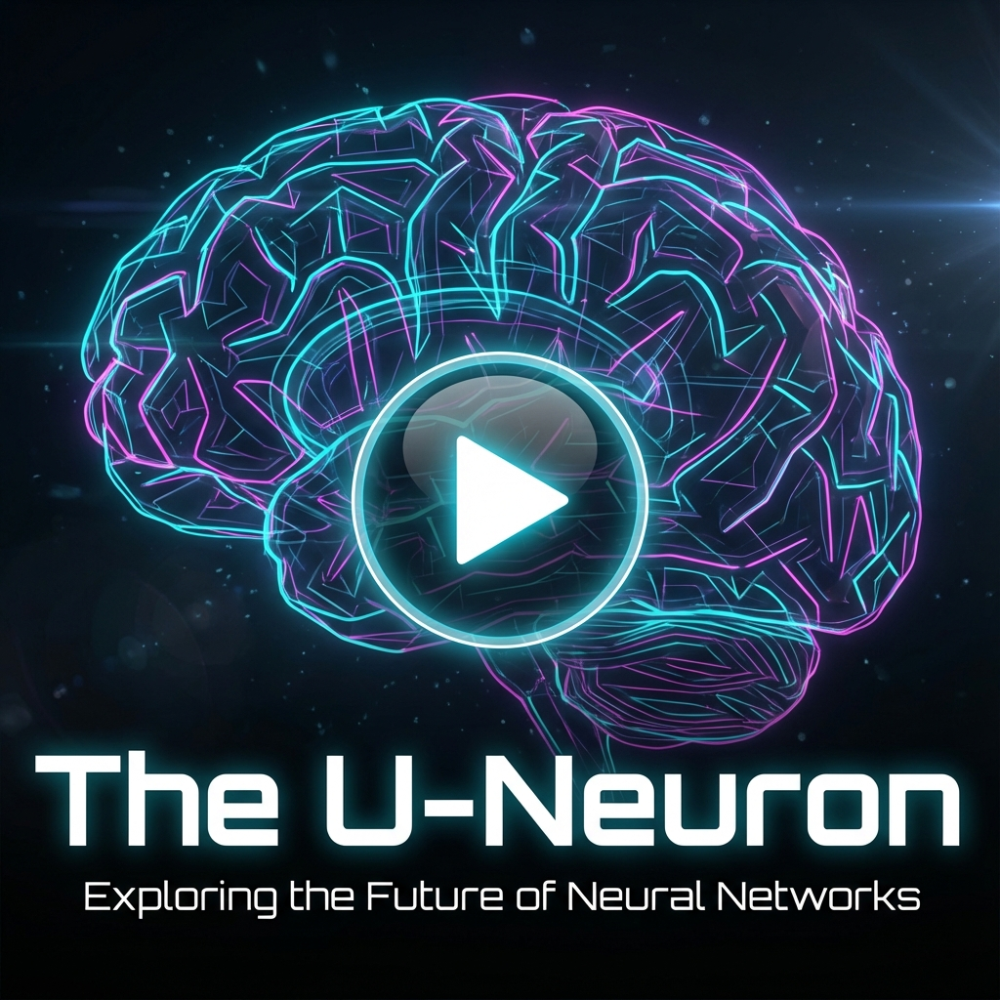
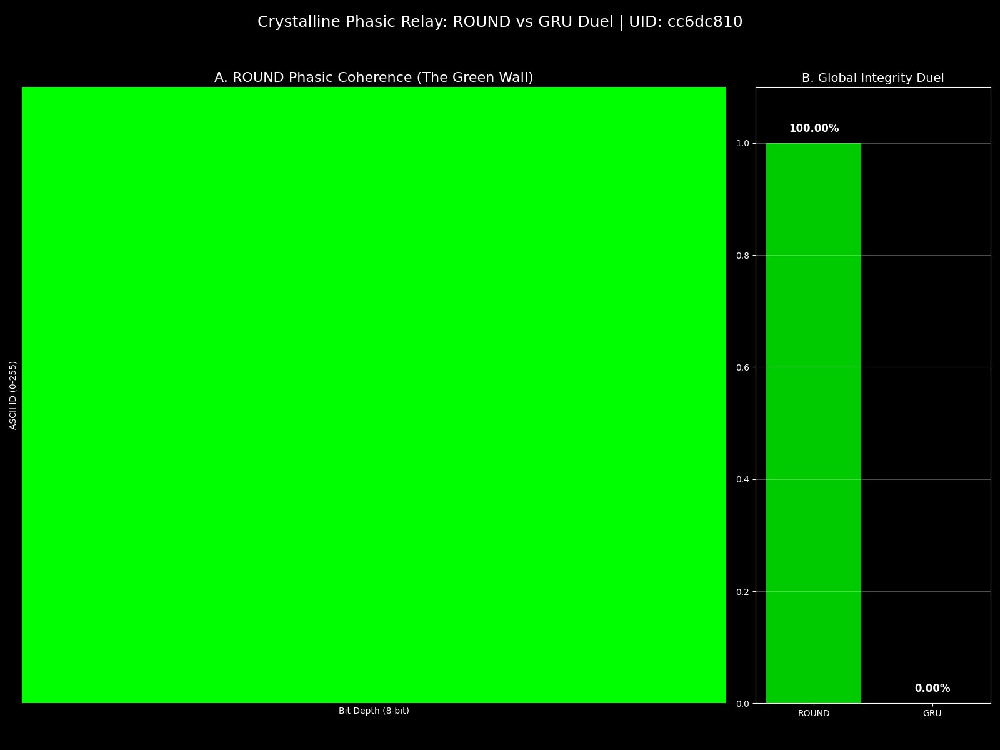

# UIT-ROUND: Harmonic 0.2.0

[](media/The_U-Neuron.mp4)
*Click to watch "The U-Neuron" concept video*

## Unified Informatic Topology (UIT) Implementation

This repository contains the reference implementation of the **U-Neuron** architecture, derived from the **Unified Informatic Topology (UIT)** framework. The project validates the theoretical predictions of UITv2, specifically regarding the physicality of information and the thermodynamic costs of computation.

At the core of this implementation is the algebraic number space $\mathcal{U}$, which unifies macroscopic signal processing with microscopic informatic thermodynamics:

$$ \mathcal{U} = \{z = x + \epsilon e^{i\phi} \mid x \in \mathbb{R}_{limited}, \epsilon \in \mathbb{R}_{infinitesimal}\} $$

---

> [!IMPORTANT]
> **Performance Warning:** These benchmarks are computationally intensive. The harmonic locking process involves high-frequency phase calculations and significant memory overhead for tracking the infinitesimal fiber. Running the full battery may stress consumer hardware. A CUDA-capable GPU with at least 8GB VRAM is recommended. The provided benchmarks were validated on an NVIDIA RTX 4090.

---

## Architectural Specification: The U-Neuron

The **U-Neuron** (implemented in `UIT_ROUND.py`) operationalizes the $\mathcal{U}$-space algebra into a differentiable neural module. Unlike standard RNNs which process a single scalar activation, the U-Neuron maintains a composite state:

$$ z_n = x_n + \epsilon_n e^{i\phi_n} $$

### 1. Macroscopic Path ($x_n$)
The standard activation path. This component handles the immediate, linear signal processing required for task performance, analogous to the hidden state in a GRU or LSTM.

### 2. Infinitesimal Fiber ($\epsilon_n, \phi_n$)
A secondary, "shadow" computational path that tracks the informatic topology of the system.
*   **Mogura Winding ($\phi_n$):** A geometric phase memory. This mechanism allows the network to "wind" information into a cyclic phase space, storing long-term structural dependencies (like nested brackets or topological invariants) without saturating the macroscopic activation. It operates orthogonally to the signal magnitude.
*   **Bernoulli Unwinding ($\epsilon_n$):** A thermodynamic gating mechanism. The epsilon gate acts as a probabilistic filter (sigmoid) that regulates the coupling between the informatic phase memory and the macroscopic output. It effectively "unwinds" the stored phase potential into actionable signal, penalizing entropy according to the Landauer limit.

---

## Experimental Validation: Benchmark Battery

The harmonic architecture has been rigorously tested against a suite of tasks designed to isolate specific informatic properties.

**Batch UID:** `cc6dc810`
**Code:** `UIT_run_battery.py`

### 1. Thermodynamic Coherence & Phase Dynamics
*Tests the interaction between the classical signal and the informatic wake.*

| Benchmark | Script | Description |
| :--- | :--- | :--- |
| **Crystalline Loop** | `UIT_benchmark_crystalline_loop.py` | Evaluates the stability of the phase information ("Phi Tail") during recurrent processing. |
| **Quantum Locking** | `UIT_benchmark_quantum_locking.py` | Tests the capability to lock phase states against perturbation. |
| **Transparency** | `UIT_benchmark_transparency.py` | Demonstrates geometric manipulability by independently steering phase/epsilon weights. |
| **Mod-N Clock** | `benchmark_clock.py` | **Perfect Phase Lock**. Tests ability to maintain precise periodic oscillations. |



### 2. Logic & Topology
*Tests the capability of Mogura Winding to handle structural complexity.*

| Benchmark | Accuracy (ROUND) | Accuracy (GRU) | Description |
| :--- | :--- | :--- | :--- |
| **Parity** | **100%** | Failure | Tests Modulo-2 logic capability, requiring non-linear phase separation. |
| **Brackets** | **100%** | < 60% | Tests dyck-language recognition, requiring stack-like memory. |
| **Topology** | **100%** | Failure | Distinguishes between tree graphs and cyclic graphs. |
| **XOR** | **100%** | Failure | Standard XOR logic test (`UIT_benchmark_xor.py`). |

### 3. Cognitive & Semantic
*Tests high-level information processing and algorithmic reversibility.*

| Benchmark | Script | Result | Description |
| :--- | :--- | :--- | :--- |
| **Color Algebra** | `UIT_benchmark_color_algebra.py` | **100%** | Tests algebraic manipulation of cyclic concepts (e.g. Red + Blue = Purple). |
| **Oracle** | `benchmark_oracle.py` | **100%** | Tests meta-learning capabilities. |
| **ASCII** | `benchmark_ascii.py` | **Pass** | Tests character-level sequence modeling. |
| **CAM** | `benchmark_cam.py` | **100%** | Content Addressable Memory test. |

---

## Repository Structure

```text
ROUND_Harmonic_0_2_0/
├── media/                  # Artifacts (PDFs, Videos, Images)
├── data/                   # Experimental outputs (Logs, Plots)
├── UIT_Benchmarks/         # Specialized encoding experiments
│   └── UIT_crystallize_encoder.py
├── UIT_ROUND.py            # Core U-Neuron implementation
├── u_matrix.py             # U-Matrix algebra utilities
├── config.py               # Hyperparameters
├── run_battery.py          # Main execution script
└── [Benchmark Scripts...]  # Individual test files
```

---

## Deep Research Artifacts

For a complete theoretical grounding, refer to the following documentation:

*   **[UITv2.pdf](media/UITv2.pdf)**: "Unified Informatic Topology: A Framework Merging Information Thermodynamics, Quantum Mechanics, and Relativity". The primary theoretical paper.
*   **[The_U-Neuron.mp4](media/The_U-Neuron.mp4)**: Video explainer of the architecture.
*   **[Unifying_Wave_and_Particle_Computation.pdf](media/Unifying_Wave_and_Particle_Computation.pdf)**: Conceptual deep dive.
*   **[Phase_Memory_Solves_AI_Long-Term_Failure.m4a](media/Phase_Memory_Solves_AI_Long-Term_Failure.m4a)**: Audio conversation on the implications of phase memory.

---

## Usage & Reproduction

To reproduce the `cc6dc810` benchmark results:

```bash
# Activate environment (Windows)
.venv\Scripts\activate

# Run the full battery
python Research/ROUND_Harmonic_0_2_0/UIT_run_battery.py
```

To run a specific benchmark:

```bash
python Research/ROUND_Harmonic_0_2_0/UIT_benchmark_crystalline_loop.py
```

### Installation

Requires Python 3.10+ and PyTorch.

```bash
pip install torch numpy matplotlib
```
