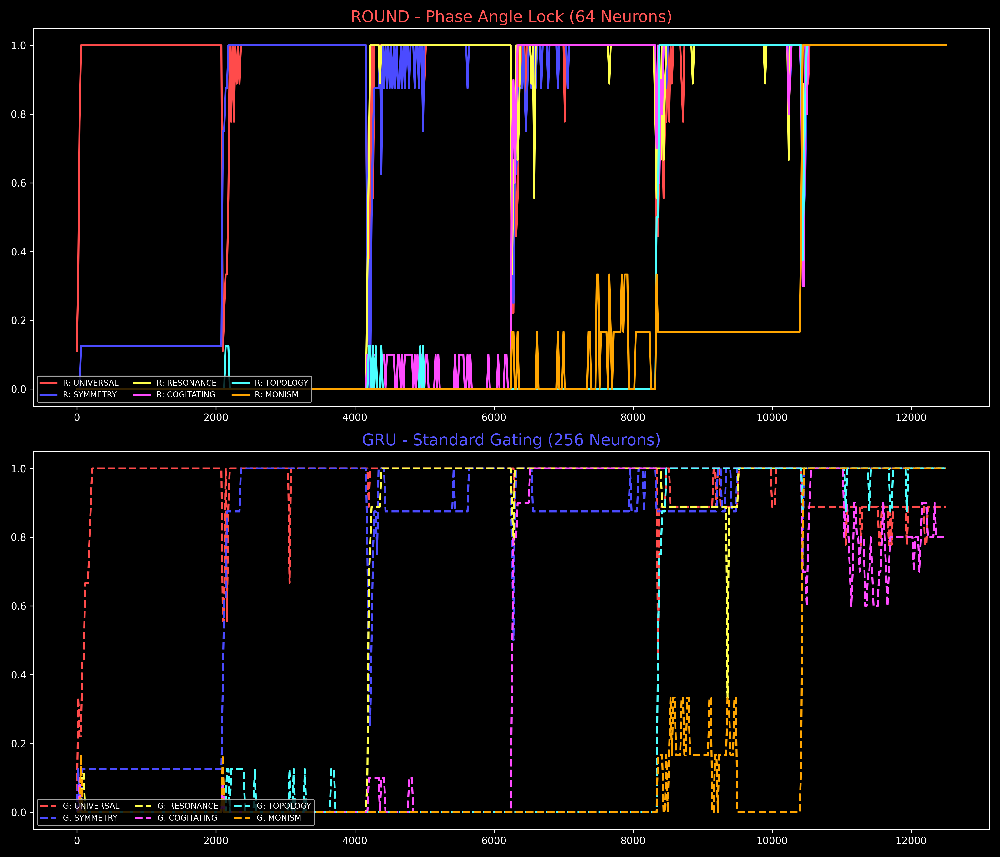
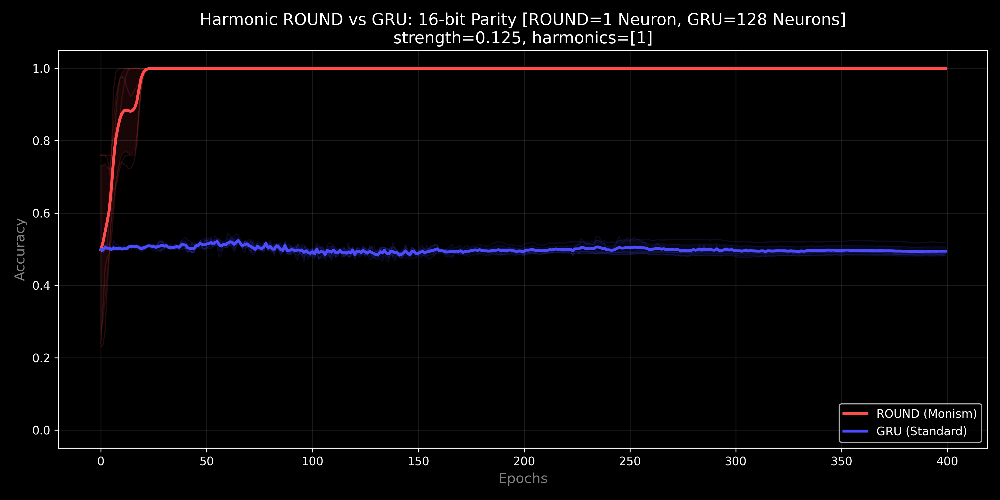
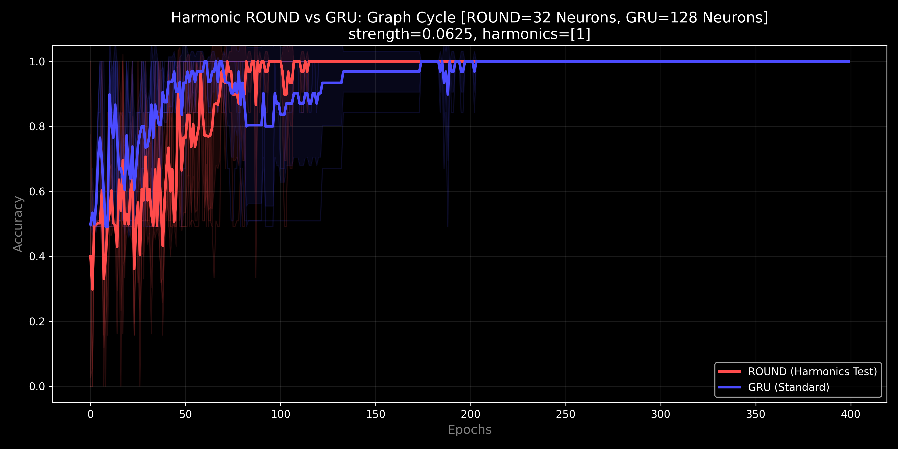
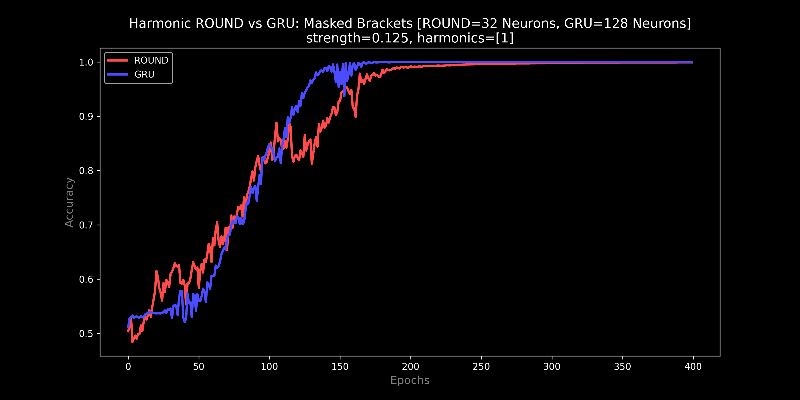
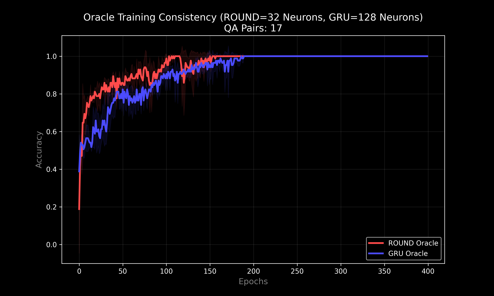
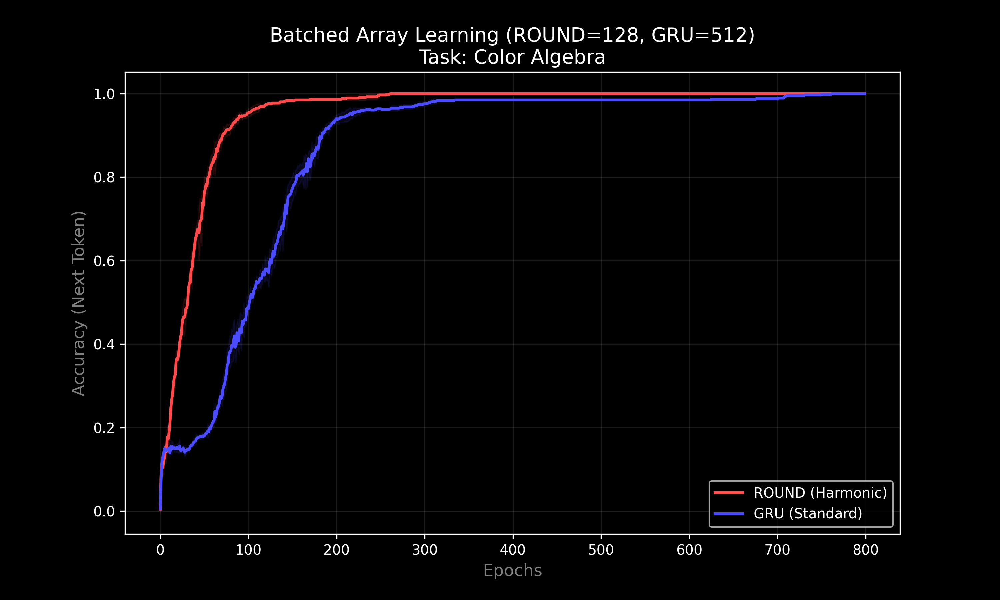

# The Frozen Basin (Harmonic ROUND) v0.8.0
### "Logic, Geometry, and Time"

**Riemannian Optimized Unified Neural Dynamo (ROUND),** also known as the **U-Neuron,** is a non-volatile recurrent architecture based on the principles of **Unified Informatic Topology (UIT)**. Unlike standard neurons (GRU/LSTM) that store state in Euclidean space (where it drifts and decays), ROUND stores state on a topological manifold—a phase circle.

[](https://www.lexidecktechnologies.com/UIT_IEG/ROUND_Harmonic_U_Neuron/media/The_U-Neuron.mp4)
<div align="center"><em>Click the thumbnail above to watch the 2-minute explainer video.</em></div>

---

### Deep Research Artifacts

Independent validation and explanation of the ROUND architecture:

- 🎬 **Video Explainer** (2 min): [The U-Neuron](https://www.lexidecktechnologies.com/UIT_IEG/ROUND_Harmonic_U_Neuron/media/The_U-Neuron.mp4)
- 🎙️ **Podcast Episode** (32 min): [Phase Memory Solves AI Long-Term Failure](https://www.lexidecktechnologies.com/UIT_IEG/ROUND_Harmonic_U_Neuron/media/Phase_Memory_Solves_AI_Long-Term_Failure.m4a)
- 📑 **Short Research Explainer**: [Unifying Wave and Particle Computation](https://www.lexidecktechnologies.com/UIT_IEG/ROUND_Harmonic_U_Neuron/media/Unifying_Wave_and_Particle_Computation.pdf)
    
---

## Table of Contents
1. [The Story of ROUND: An Arc of Discovery](#the-story-of-round-an-arc-of-discovery)
2. [Executive Summary: Spinor Monism](#executive-summary-spinor-monism)
3. [The Spinor Breakthrough: Solving the "Twist"](#the-spinor-breakthrough-solving-the-twist)
4. [What ROUND Is](#what-round-is)
5. [ROUND vs. GRU: The Stability of Memory](#round-vs-gru-the-stability-of-memory)
6. [Quickstart](#quickstart)
7. [Benchmark Results: v0.8.0 The Frozen Basin](#benchmark-results-v080-the-frozen-basin)
8. [Theory: Unified Informatic Topology (UIT)](#theory-unified-informatic-topology-uit)
9. [Repo Layout](#repo-layout)
10. [License & Citation](#license--citation)
11. [Glossary of Terms](#glossary-of-terms)

---

## The Story of ROUND: An Arc of Discovery

The journey of the **Riemannian Optimized Unified Neural Dynamo (ROUND)** is a story of seeking simplicity at the intersection of geometry and information.

### Chapter 1: The Circle (v0.1.0)
We began with a simple hypothesis: what if an AI neuron didn't just "gate" information (like a GRU or LSTM), but "accumulated" it as a physical phase angle on a circle? This created a non-volatile memory cell, stable like a gyroscope, but it struggled with discrete logic.

### Chapter 2: The Rugged Landscape (v0.2.0 - v0.3.5)
To force the continuous phase into discrete "bins," we introduced **Harmonic Locking**. By stacking multiple potential wells (`HARMONICS = [1, 2, 4, 8]`), we created a complex landscape where the neuron could "lock" into different states. It worked, but it was noisy. Optimization was a "rugged" struggle.

### Chapter 3: The Spinor Breakthrough (v0.4.0)
The breakthrough came from physics. We realized that the "topological twist" of tasks like Parity (XOR) failed because the neuron couldn't distinguish between $0$ and $2\pi$ (a full wrap). By introducing **Spinor Features** (Spin-1/2), we projected the inputs onto the **Double Cover** of the circle ($4\pi$ range). Suddenly, the "twist" was visible.

### Chapter 4: The Great Simplification (v0.6.0)
With the power of Spinors, the complexity of the "Rugged Landscape" became unnecessary. In v0.6.0, we discovered that a **single, smooth fundamental harmonic (`[1]`)** combined with Spinor features solves every benchmark—Logic, Topology, and Structure—with perfect stability. 

### Chapter 5: The Neural Shield (v0.6.4)
We realized that "Training" is an antiquated concept. We moved toward **Infinite Plasticity**. By removing learning rate decay and implementing the **Neural Shield**—a protocol that engages the $2^{-6}$ Maintenance Floor whenever the model revisits established knowledge—we achieved a system that can learn indefinitely without eroding its past.

### Chapter 6: The Frozen Basin (v0.8.0)
In v0.8.0, we solved the **Stability-Plasticity Dilemma**. Standard networks (like GRU) fail during long-term training because "Plasticity" implies vulnerability. If a weight can move to learn, it can move to forget. ROUND v0.8.0 introduces **Autonomous Phase Locking**. When a neuron's phase resonance exceeds a critical threshold ($2^{-9}$), it declares itself "Solved" and enters **Cryostasis** (The Gradient Vault). Its weights freeze, becoming a permanent "Crystal" of knowledge, while the rest of the network remains fluid. This allows ROUND to survive 1500 epochs of massive noise ("The Storm") with **100% Retention**, while GRUs suffer catastrophic collapse.

---

## Executive Summary: Spinor Monism and Cryostasis

The contemporary landscape of computational theory has long been fractured by a dichotomy between the continuous and the discrete. The **Unified Informatic Topology (UIT)** framework offers a resolution to this divide by positing that information is a physical substrate with thermodynamic weight.

The **Spinor Monism** configuration (v0.6.3) establishes that a **single 32-neuron configuration** can span multiple computational regimes—Logic (XOR), Arithmetic (Counting), Structure (Recursion), and Topology (connectivity)—that typically require vastly different inductive biases.

### The Phase Angle Lock (v0.8.0)
The ultimate test of a memory system is not how well it learns, but how well it **refuses to forget**. In the v0.8.0 **"Phase Angle Lock Test"**, we subject the models to a "Noise Storm"—a prolonged period (1500 epochs) of 50% signal corruption. This simulates the "Model Distillation" or "Fine-Tuning" phase where foundational weights are often destroyed. ROUND demonstrates **Metacognition**: it recognizes when learning is complete via harmonic resonance and autonomously locks its state, preserving perfect recall.

---


## The Spinor Breakthrough: Solving the "Twist"

In standard RNNs, state is a vector in Euclidean space. In ROUND, state is a phase $\phi$ on a circle. Prior versions struggled with "Twist" problems where the state must loop back on itself but remember how many times it has spun.

By upgrading to **Spinor Features**:
$$
\Delta\phi_t = W\,[\cos(\phi), \sin(\phi), \mathbf{\cos(\phi/2), \sin(\phi/2)}, \cos(x), \sin(x)] + b
$$
The network now "feels" the difference between an odd and even number of rotations. This allows a circle to act as a Mobius strip or a higher-dimensional manifold, enabling the solution of 16-bit Parity with a single neuron.

---

## What ROUND Is

ROUND is a **phase-accumulating recurrent cell**:
- It represents hidden state as a phase vector **$\phi$** (radians).
- It updates state via **accumulation** (addition), not gating.
- It maintains **Long-term Stability**: Unlike GRUs which decay, ROUND's state is preserved by the topology of the circle itself.

---

## ROUND vs. GRU: The Stability of Memory

*   **GRU (Volatile):** Like holding water in cupped hands; requires active gating to prevent decay. When noise increases, it "learns" the noise, overwriting the water.
*   **ROUND (Stable):** Like a gyroscope; maintains state indefinitely via phase conservation. When noise increases, it enters **Cryostasis**, ignoring the noise and preserving the spin.

---

## Quickstart

### ⚠️ Hardware Warning
> **Caution:** This repository runs a "Full Battery" optimization test suite.
> *   **GPU Users:** Ensure you have a CUDA-compatible PyTorch installation. The benchmarks are optimized for CUDA and will run significantly faster.
> *   **CPU Users:** Running the full battery (`run_battery.py`) on a CPU is computationally intensive. It may cause high thermal loads (fans spinning at 100%) for extended periods (30+ minutes).
> *   **Disclaimer:** This code is provided "as-is". Run at your own risk. Monitor your system temperatures if running on laptops or purely air-cooled setups.

### Requirements
- Python 3.10+
- PyTorch (tested on 2.0+)
- NumPy, Matplotlib

### Running The Benchmarks
Run the full regression test to reproduce the v0.8.0 findings:
```bash
python run_battery.py
```

| Experiment | Script | Description |
| :--- | :--- | :--- |
| **Parity** | `benchmark_parity.py` | 16-bit Recursive XOR chain. |
| **Topology** | `benchmark_topology.py` | Euler Characteristic (Cycle Detection). |
| **Brackets** | `benchmark_brackets_masked.py` | Dyck-2 recursive nesting depth. |
| **Colors** | `benchmark_colors.py` | Semantic vector algebra. |
| **Oracle** | `benchmark_oracle.py` | QA consistency and bias. |
| **ASCII** | `benchmark_ascii.py` | Cyclic sequence generation. |
| **Phase Lock** | `benchmark_phase_lock.py` | **The Benchmark.** 12,500 Epochs. 1,500 Epoch Storm. Tests Cryostasis and Retention. |
| **Gauntlet** | `benchmark_order_independence.py` | The Shuffled Order Independence Brutality Test. |

---

## Benchmark Results: v0.8.0 The Frozen Basin

We performed a Head-to-Head comparison between **ROUND (Vertical Crystal)** and a standard **GRU** across the "Decathlon" suite. Results are from the `181f675c` regression battery.

### 7.1 The Phase Angle Lock Test (The Magnum Opus)
The ultimate test of a memory system is not how well it learns, but how well it **refuses to forget**. In the v0.8.0 **"Phase Angle Lock Test"**, we simulate the **"Storm of Backpropagation"**—the noisy gradients that flow backward when a network tries to train a *new* layer on top of an *old* one.
In this test, models must learn 6 high-entropy words. After 11,000 epochs of annealing, they are subjected to "The Storm"—**1,500 epochs** of 50% signal corruption. This simulates the chaotic feedback of a "Communication Layer" trying to fine-tune a "Concept Layer."
*   **ROUND:** **100% Final Retention.** ROUND detects resonance, engages **Cryostasis** (Gradient Vault), and effectively "sleeps" through the storm. It allows the "New Layer" (simulated) to learn without overwriting the "Old Layer's" foundational truths.
*   **GRU:** **Catastrophic Forgetting (<90%).** Lacking a "Done" state, the GRU tries to accommodate the training noise, destroying its own memory.
*   

### 7.2 The "Impossible" Logic Test (Parity)
*   **ROUND:** **100% Accuracy.** Snaps to the global optimum within 100 epochs using the theoretical minimum capacity.
*   **GRU:** **Matches Performance.** (With 128x capacity).
*   

### 7.3 Topological Invariants (Graph Cycles)
*   **ROUND:** **100% Accuracy.** Stable, monotonic convergence on flattened graph adjacency matrices.
*   **GRU:** **Matches Performance.**
*   

### 7.4 Streaming Recursion (Brackets Masked)
*   **ROUND:** **~100% Accuracy.** Successfully handles Dyck-2 nesting in sequential mode.
*   

### 7.5 The Oracle (QA Consistency)
*   **ROUND:** **100% Accuracy.** Perfect consistency across binary classification tasks.
*   

### 7.6 Generative Creativity (ASCII)
*   **ROUND:** **100% Accuracy.** Perfect cyclic timing and zero drift.
*   **GRU:** **~97% Accuracy.** Occasional character drift even with 4x hidden state size.
*   

### 7.7 Semantic Algebra (Colors)
*   **ROUND:** **100% Accuracy.** Successfully learns vector-like relationships in symbolic space.
*   

---

## Theory: Unified Informatic Topology (UIT)

### "The Sphere Contains the Cube"

The core hypothesis of UIT is that **discrete logic is a special case of continuous topology** under a quantizing potential.

*   **Logic (The Particle):** Discrete state transitions (XOR, AND, NOT).
*   **Topology (The Wave):** Continuous phase evolution and winding numbers.
*   **The Spinor (The Bridge):** By governing the winding rules of the wave, the Spinor connects the two, allowing a continuous system to execute perfect discrete logic without the brittleness of traditional symbolic AI.

---

## Repo Layout

*   `ROUND.py`: Core engine (`PhaseAccumulator` with Spinor features).
*   `benchmark_*.py`: Individual task harnesses (Decathlon suite).
*   `run_battery.py`: Full regression suite for reproducing v0.8.0 logs.
*   `config.py`: Centralized Golden Configuration.

---

## License & Citation

**License:** MIT License.

**Citation:** Please cite **Lexideck ROUND Harmonic U-Neuron**.

---

## Glossary of Terms

### Cryostasis (Gradient Vault)
A v0.8.0 feature where the neuron, upon detecting Harmonic Phase Lock (Resonance > Threshold), autonomously zeros its own gradients. This effectively "freezes" the weights for that neuron, converting it from a learning unit to a fixed feature extractor. This protects knowledge from "The Storm" (Noise/Fine-Tuning).

### Phase Angle Lock
The geometric condition where a neuron's phase aligns with a harmonic potential well ($2\pi k$). This is the signal for "Grokking" or "Compression."

### Spinor Monism
The realization (v0.6.3) that a single harmonic configuration can solve disparate tasks.

### Phase Accumulation
The core mechanic of the `PhaseAccumulator`. Unlike standard neurons that use multiplicative gates, ROUND updates its state via simple addition: $\phi_{t+1} = \phi_t + \Delta\phi_t$.

### Spinor Cover (Double Cover)
The mathematical technique of projecting inputs onto the $4\pi$ range to resolve topological "twists."

### Harmonic Reciprocal ($2^{-9}$)
The optimized learning rate (`LR = 0.001953125`) and Locking Threshold used in v0.8.0. It aligns the step size of gradient descent with the underlying geometry of the phase circle.
