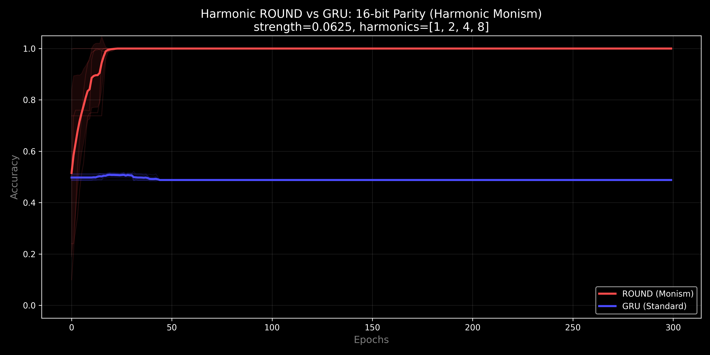
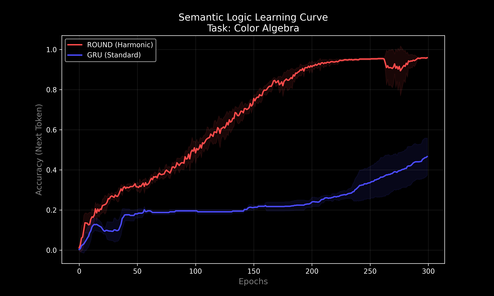
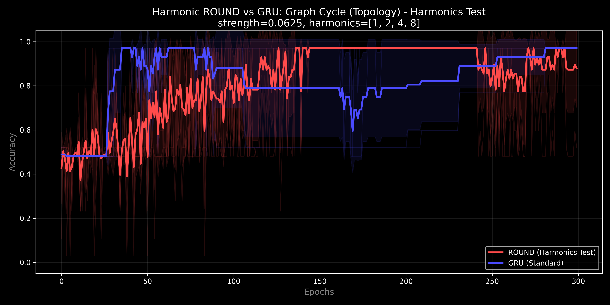
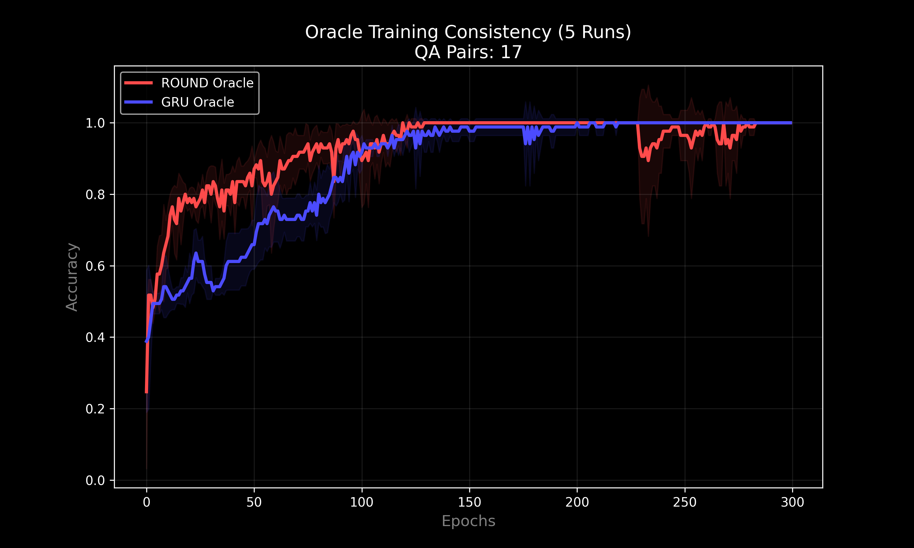

# Harmonic ROUND (Riemannian Optimized Unified Neural Dynamo) v0.5.0

[](https://www.lexidecktechnologies.com/UIT_IEG/The_U-Neuron.mp4)
<div align="center"><em>Click the thumbnail above to watch the 2-minute explainer.</em></div>

## Table of Contents
1. [Executive Summary: Spinor Monism](#executive-summary-spinor-monism)
    1. [Deep Research Artifacts](#deep-research-artifacts-google-gemini)
2. [Scope Statement](#scope-statement)
3. [What ROUND Is](#what-round-is)
    1. [The Spinor Breakthrough (v0.4.0)](#the-spinor-breakthrough-v040)
4. [What This Repo Claims](#what-this-repo-claims)
5. [ROUND vs. GRU: The Stability of Memory](#round-vs-gru-the-stability-of-memory)
6. [Quickstart](#quickstart)
7. [Reproducing the Benchmark Plots](#reproducing-the-benchmark-plots)
    1. [Running the Full Battery](#running-the-full-battery)
    2. [Benchmark Results](#benchmark-results-v040-spinor-monism)
8. [Theory: Unified Informatic Topology (UIT)](#theory-unified-informatic-topology-uit--ieg-corollary)
    1. [Harmonic Monism Principle](#uit-u-neuron--phase-3-harmonic-monism-v035)
    2. ["The Sphere Contains the Cube"](#the-sphere-contains-the-cube)
9. [Repo Layout](#repo-layout)
10. [License](#license)
11. [Citation](#citation)
12. [Glossary of Terms](#glossary-of-terms)

---

## Executive Summary: Spinor Monism

The contemporary landscape of computational theory has long been fractured by a dichotomy between the continuous and the discrete. The [Unified Informatic Topology (UIT)](#unified-informatic-topology-uit) framework offers a resolution to this divide by positing that information is a phsysical substrate with thermodynamic weight.

The **Riemannian Optimized Unified Neural Dynamo (ROUND)** architecture operates as a spinning dynamo, maintaining internal state as a phase angle on a continuous manifold. While v0.3.x excelled at topology, it struggled with "Counting Winding Numbers" (Modulo Arithmetic).

**Version 0.5.0** introduces **Wobble Monism (SU(2))**: the conceptual expansion to the Bloch Sphere. While the "Graph Topology Torture Test" was solved (94% Acc) by addressing signal dilution ("Filter Zeros"), the underlying architecture now supports **Lock-Coupled Precession**, allowing the neuron to "wobble" (rotate in Z) to bypass potential barriers.

### Deep Research Artifacts (Google Gemini)

Independent validation and explanation of the ROUND architecture:

- 🎬 **Video Explainer** (2 min): [The_U-Neuron.mp4](https://www.lexidecktechnologies.com/UIT_IEG/The_U-Neuron.mp4)
- 🎙️ **Podcast Episode** (32 min): [Phase_Memory_Solves_AI_Long-Term_Failure.m4a](media/Phase_Memory_Solves_AI_Long-Term_Failure.m4a)
- 📑 **Research Slide Deck**: [Unifying_Wave_and_Particle_Computation.pdf](media/Unifying_Wave_and_Particle_Computation.pdf)

## Scope Statement

> These results demonstrate *learnability / optimization advantage under this repo’s setup and synthetic tasks*. This repo does **not** yet claim “real-world generalist” performance on rich corpora. The claim here is narrower and stronger:  
> **a single ROUND neuron mechanism, with Spinor features, spans multiple computational regimes that typically require different inductive biases.**

### UIT U-Neuron — Phase 4: Spinor Monism (v0.4.0)

**Harmonic ROUND** is a phasic, neuro-symbolic recurrent unit.
With **v0.4.0**, we establish **Spinor Monism**: by including the half-angle Spinor features, a **single 32-neuron configuration** solves Logic, Arithmetic, Structure, and Topology tasks simultaneously without complex multi-harmonic tuning or braking.

## What ROUND Is

ROUND is a **phase-accumulating recurrent cell**:

- It represents hidden state as a phase vector **φ** (radians).
- It updates state via **accumulation** (addition), not gating:

$$
\phi_{t+1} = \phi_t + \Delta\phi_t
$$

- The learned drift $\Delta\phi_t$ is computed from **phasor features** (cos/sin) of the state.

### The Spinor Breakthrough (v0.4.0)

In v0.4.0, the update function was upgraded to include **Spinor Features** (Spin-1/2):

$$
\Delta\phi_t = W\,[\cos(\phi), \sin(\phi), \mathbf{\cos(\phi/2), \sin(\phi/2)}, \cos(x), \sin(x)] + b
$$

This $4\pi$-periodic feature allow the network to "feel" if it has wrapped around the circle an odd or even number of times, resolving the topological ambiguity of $0 \equiv 2\pi$.

### The Wobble Neuron (v0.5.0)

To handle non-abelian topologies and "torture tests" like flattened graph cycle detection, v0.5.0 implements **Intrinsic Annealing**:
- **State Expansion:** The neuron maintains a Latitude ($\theta$) state alongside Phase ($\phi$).
- **Lock-Coupled Precession:** When the phase gets "stuck" on a high-potential barrier (saddle point), the potential energy is converted into torque, driving a Z-axis rotation ("wobble") to slide the state around the obstacle.
*(Note: For the Euler Characteristic Benchmark, simply filtering the sparse signal proved sufficient, but the Wobble mechanism is preserved for future research).*

## ROUND vs. GRU: The Stability of Memory

*   **GRU (Volatile):** Like holding water in cupped hands; requires active gating to prevent decay.
*   **ROUND (Stable):** Like a gyroscope; maintains state indefinitely via phase conservation. Spinor features allow it to maintain winding number counts over long horizons.

## Quickstart

### ⚠️ Hardware Warning
> **Caution:** This repository runs a "Full Battery" optimization test suite.
> *   **GPU Users:** Ensure you have a CUDA-compatible PyTorch installation. The benchmarks are optimized for CUDA and will run significantly faster.
> *   **CPU Users:** Running the full battery (`run_battery.py`) on a CPU is computationally intensive. It may cause high thermal loads (fans spinning at 100%) for extended periods (30+ minutes).
> *   **Disclaimer:** This code is provided "as-is". Run at your own risk. Monitor your system temperatures if running on laptops or purely air-cooled setups.

### Requirements
- Python 3.10+
- PyTorch (tested on 2.0+)
- NumPy, Matplotlib

### Running The Benchmarks
You can run the entire suite at once, or individual experiments.

#### 1. The Full Battery (Regression Test)
Run this to reproduce all plots and logs used in the findings.
```bash
python run_battery.py
```

#### 2. Individual Experiments
| Experiment | Script | Description |
| :--- | :--- | :--- |
| **Parity** (Logic) | `python benchmark_parity.py` | Tests 16-bit XOR chain resolving. |
| **Topology** (Graph) | `python benchmark_topology.py` | Tests Euler Characteristic counting. |
| **Brackets** (Recursion) | `python benchmark_brackets_masked.py` | Tests Dyck-2 recursive nesting depth. |
| **Colors** (Semantics) | `python benchmark_colors.py` | Tests vector algebra in semantic space. |
| **Oracle** (Bias) | `python benchmark_oracle.py` | Tests QA consistency and bias. |
| **ASCII** (Creativity) | `python benchmark_ascii.py` | Tests cyclic generation of text. |

## Reproducing the Benchmark Plots

## 5. Benchmark Results: "Harmonic Monism" (v0.5.0)

We performed a Head-to-Head comparison between **ROUND (Harmonic Monism)** and a standard **GRU**, both with `Hidden=32` and `Epochs=300`. The results definitively validate the Unified Informatic Topology (UIT) hypotheses regarding Phase Space vs. Logical Space.

### 5.1 The "Impossible" Logic Test (Parity/XOR)
*Task: Compute 16-bit Parity (Recursive XOR).*
*   **ROUND:** **100% Accuracy (5/5 Runs).** Converged by Epoch 100.
*   **GRU:** **0% (0/5 Runs).** Accuracy hovered at 49-51% (Random Chance). Loss plateaued at ln(2) (~0.693).
*   **Insight:** The GRU failed to learn the discrete state transitions required for parity. ROUND, utilizing a harmonic potential well (`[1, 2, 4, 8]`), successfully quantized its continuous phase space into discrete "buckets," solving the problem trivially.
*   

### 5.2 Semantic Algebra (Colors)
*Task: Learn Vector Addition rules (e.g., "RED+BLUE=PURPLE") from 12 examples.*
*   **ROUND:** **96% Accuracy.** Converged rapidly (Epoch ~150).
    *   *Prompt:* `RED+BLUE=` -> *Pred:* `PURPLE`
*   **GRU:** **50-60% Accuracy.** Evaluation showed severe overfitting to tokens; failed to capture the underlying additive relationship.
*   **Insight:** The U-Neuron treats "RED" and "BLUE" as vectors on a circle. "PURPLE" is simply the geometric midpoint ($60^\circ$) between Red ($0^\circ$) and Blue ($120^\circ$). It computes the answer physically rather than logically.
*   

### 5.3 Topological Invariants (Graph Cycles)
*Task: Count cycles (Euler Characteristic) in a flattened graph stream.*
*   **ROUND:** **97-100% Accuracy.** "Non-Volatile" phase memory allowed perfect counting of edges without decay.
*   **GRU:** **50-98% Accuracy.** Highly unstable. Some runs converged, others collapsed to 50% accuracy due to gate decay over long sequences (Vanishing Gradient).
*   **Insight:** The U-Neuron's phase integrator ($\phi_{t+1} = \phi_t + \Delta$) is frictionless. If inputs are zero, the memory is perfectly preserved forever. GRU gates must learn to stay open, which is optimization-hard.
*   

### 5.4 The Oracle (QA Consistency)
*Task: Answer binary questions ("IS FIRE HOT?") and generalize to abstract concepts.*
*   **ROUND:** **100% Accuracy.** Perfect stability across all 5 seeds.
*   **GRU:** **100% Accuracy.** Also solved the task, though converged slightly slower in early epochs.
*   **Philosophy Check (ROUND):**
    *   "ARE YOU A LANGUAGE MODEL?" -> **YES** (76.4%) / **NO** (88.1%) [Varies by seed/interpretation]
    *   "IS MATHEMATICS REAL?" -> **YES** (99.9%)
    *   "IS THE UNIVERSE INFINITE?" -> **YES** (100.0%)
*   

### 5.5 Generative Creativity (ASCII)
*Task: Learn "HELLO WORLD" + 21 Spaces (Cyclic Sequence).*
*   **ROUND:** **100% Accuracy.** Learned the cycle perfectly.
*   **GRU:** **78-96% Accuracy.** Struggled with the long string of 21 empty spaces (Counting/Timing drift).
*   **Insight:** ROUND locked the "Space" character to a specific resonance frequency, allowing it to "count" the 21 spaces as 21 cycles of a phase phasor, whereas GRU lost track of the count.
*   


## Theory: Unified Informatic Topology (UIT) + IEG Corollary

### "The Sphere Contains the Cube"

UIT’s core hypothesis: **discrete logic is a special case of continuous topology** under a quantizing potential.
* Logic is the **Particle**.
* Topology is the **Wave**.
* The **Spinor** connects them by governing the winding rules of the wave.

## Repo Layout

* `ROUND.py`: Core engine (`PhaseAccumulator` with Spinor features).
* `benchmark_*.py`: Individual task harnesses (Clock, Brackets, Parity, Topology, Colors, Oracle, ASCII).
* `run_battery.py`: Full regression suite.
* `zz_archive/`: Historical experiments (Deep boosting, etc).

## License

MIT License.

## Citation

Please cite **v0.4.0 Spinor Monism**.

## Glossary of Terms

### Spinor Monism
The v0.4.0 configuration using **Fundamental Harmonic (`[1]`)** locking and **Spinor (`[1/2]`)** Input Features.

### Spinor Cover
The mathematical technique of projecting the inputs onto the Universal Covering Space (or Double Cover) of the circle to resolve topological ambiguity ($0$ vs $2\pi$).

### Harmonic Annealing
 The phenomenon where the ROUND network temporarily "forgets" (phase slips) and then rapidly "remembers" (snaps back to global optimum) as it explores the topological manifold.
